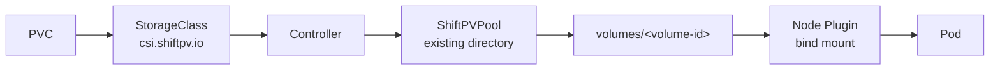

# ShiftPV

ShiftPV is a CSI driver for managed, movable local volumes inside existing Linux
filesystems. It replaces a basic hostPath StorageClass with standard PVC lifecycle,
Pool capacity admission, and planned node-to-node movement.

## Architecture



Application I/O follows the node-local bind mount. The Controller and network copy
path participate in lifecycle and movement only.

## Feature map

| Area | Current contract |
|---|---|
| Volume | Dynamic RWO Filesystem provisioning |
| Placement | `WaitForFirstConsumer` topology |
| Storage | One existing absolute Pool directory per participating node |
| Capacity | Pool reservation limit plus containing-filesystem availability |
| Readiness | Directory access, write/sync/cleanup, and `statfs` probes |
| Mobility | Healthy cordoned-node cold migration with authenticated rsync |
| Authority | One owner node, one active Move, CSI publish guard |
| Recovery | Restart-safe reconcile and explicit `ResumeOwner` |
| Lifecycle | `Retain` PVs and guarded Helm/Argo CD uninstall |
| Delivery | Helm repository and multi-architecture images |

The Kubernetes API is represented by three cluster-scoped resources:

```text
ShiftPVPool    node + Pool directory + capacity + readiness
ShiftPVVolume volume handle + owner + publish state + active Move
ShiftPVMove   one movement transaction + phase + diagnosis + recovery
```

## Runtime model

```text
<registered Pool>/
├── volumes/
│   └── <volume-id>/       authoritative PVC data
└── .shiftpv/
    ├── incoming/          verified destination staging
    ├── retired/           source purge staging
    └── aborted/           recovery quarantine
```

Pool paths may differ by node and may be ordinary root-filesystem directories or
directories on separate mounts. ShiftPV manages its directory layout; the operator
owns disks, filesystems, encryption, mounts, and backup.

## Requirements

| Requirement | Value |
|---|---|
| Kubernetes | 1.35+ |
| Nodes | Linux |
| Node access | Privileged DaemonSet with HostPath |
| Pool | Existing writable absolute non-root directory |
| Argo CD | 3.3+ for guarded Application deletion |

MicroK8s normally uses
`/var/snap/microk8s/common/var/lib/kubelet` as its kubelet state root.

## Install

```bash
helm repo add shiftpv https://cagojeiger.github.io/ShiftPV
helm repo update shiftpv
helm install shiftpv shiftpv/shiftpv \
  --namespace shiftpv-system --create-namespace
```

Register one Pool for each participating node after the chart is ready:

```yaml
apiVersion: shiftpv.io/v1alpha1
kind: ShiftPVPool
metadata:
  name: worker-a
spec:
  nodeName: worker-a
  mountPath: /var/lib/shiftpv
  capacity:
    limit: 500Gi
```

```bash
kubectl wait --for=condition=Ready shiftpvpool/worker-a --timeout=2m
```

Automatic mobility is enabled for selected workload namespaces:

```bash
kubectl label namespace my-workload shiftpv.io/admission=enabled
```

Deployment values, MicroK8s configuration, upgrades, and removal are documented in
the [Helm chart guide](charts/shiftpv/README.md).

## Support boundary

| Capability | Ownership |
|---|---|
| Planned movement from a healthy cordoned node | ShiftPV |
| Replication, HA, unavailable-node failover | External storage architecture |
| Snapshot and backup | External data-protection system |
| RWO Filesystem | ShiftPV |
| RWX, raw block, volume expansion | Current scope outside ShiftPV |
| Pool-wide admission | ShiftPV |
| Per-volume filesystem quota | Filesystem or external quota manager |
| Existing PV migration | Workload-specific migration procedure |

## Documentation

| Question | Document |
|---|---|
| Why is the architecture shaped this way? | [ADR](docs/adr/README.md) |
| What behavior does the product guarantee? | [Specifications](docs/spec/README.md) |
| How is the source changed and tested? | [Development](docs/development/README.md) |
| What has run in real environments? | [Validation evidence](docs/validation/README.md) |

## Status

Early `dev-v1` product. CI covers unit, race, Linux mount, Helm, CSI, mobility,
node-restart, and Argo CD lifecycle paths. Dated environment evidence remains in
`docs/validation/`.

## License

Apache-2.0 — see [LICENSE](LICENSE).
