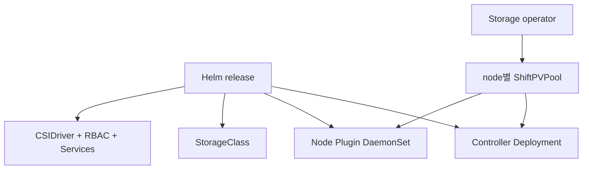
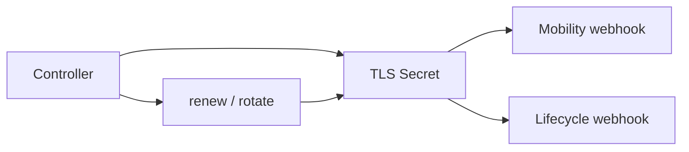
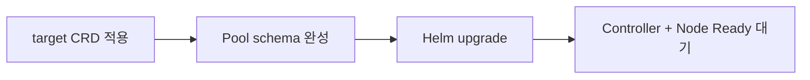
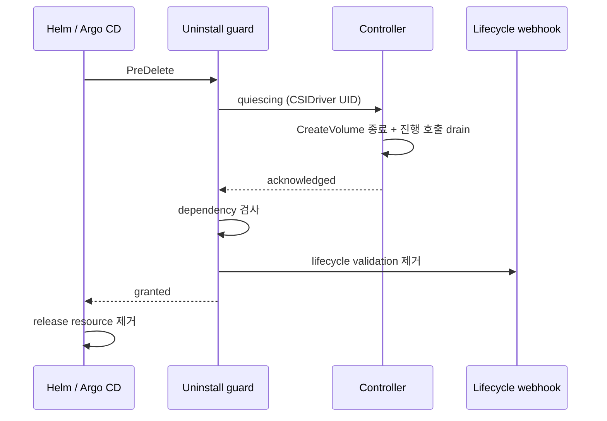

# ShiftPV Helm chart

Chart는 CSI runtime, StorageClass, admission endpoint, RBAC와 안전한 제거 lifecycle을 설치한다.
Node Pool은 storage 운영자가 별도로 등록한다.



## Install

```bash
helm repo add shiftpv https://cagojeiger.github.io/ShiftPV
helm repo update shiftpv
helm install shiftpv shiftpv/shiftpv \
  --namespace shiftpv-system --create-namespace \
  --wait
```

Repository 개발에서는 `shiftpv/shiftpv` 대신 `./charts/shiftpv`를 사용한다. Chart, Controller,
Node 버전은 독립적으로 release하고 공개 chart가 multi-architecture image tag를 선택한다.

### Kubelet state root

| Kubernetes 구성 | 값 |
|---|---|
| 일반 kubelet | `/var/lib/kubelet` |
| MicroK8s | `/var/snap/microk8s/common/var/lib/kubelet` |

MicroK8s 설치:

```bash
helm install shiftpv shiftpv/shiftpv \
  --namespace shiftpv-system --create-namespace \
  --set node.kubeletRootDir=/var/snap/microk8s/common/var/lib/kubelet \
  --wait
```

한 release는 kubelet root가 같은 node 집합을 담당한다. `node.nodeSelector`로 해당 집합을 선택한다.

## Metrics

```yaml
metrics:
  enabled: true
  port: 8080
  snapshotInterval: 30s
  serviceMonitor:
    enabled: true
    interval: 30s
    scrapeTimeout: 5s
    additionalLabels:
      release: kube-prometheus-stack
```

| 설정 | 동작 |
|---|---|
| 기본값 | metrics와 ServiceMonitor 모두 false |
| metrics 활성화 | Controller/Node 내부 HTTP endpoint와 ClusterIP Service 두 개 |
| ServiceMonitor 활성화 | 설치된 Prometheus Operator CRD 사용; `additionalLabels`를 Prometheus selector에 맞춤 |
| Node 관측 주기 | 기존 `poolReadiness.interval` 사용 |
| API 관측 주기 | `snapshotInterval`; timeout 10s |
| 접근 | monitoring namespace에서 metrics port로 접근 허용; 외부 공개와 별개 |

Endpoint는 인증 없는 내부 HTTP다. 네트워크 접근 범위는 운영 환경의 NetworkPolicy로 제한한다.
ServiceMonitor를 사용하지 않는 Prometheus도 두 Service의 endpoint를 발견해 수집할 수 있다.
Argo CD에서는 values를 Git으로 관리하고 Operator CRD를 먼저 설치한다.
[지표 계약](../../docs/spec/metrics.md)은 논리 예약과 filesystem 여유를 구분한다.

### Grafana dashboard

| 배포 구성 | 설정 |
|---|---|
| 같은 cluster의 Grafana sidecar | `metrics.dashboard.enabled: true`; 기본 label `grafana_dashboard: "1"` |
| Sidecar label 변경 | `metrics.dashboard.labels`를 Grafana selector에 맞춤 |
| 중앙 Grafana | Chart의 `dashboards/shiftpv-overview.json`을 중앙 cluster의 dashboard ConfigMap으로 GitOps 관리 |
| 수동 import | 동일 JSON을 import하고 Prometheus datasource 선택 |

Dashboard ConfigMap은 기본 false이며 Grafana를 설치하지 않는다. 활성화 시 release namespace에
생성된다. Grafana sidecar가 해당 namespace를 감시하도록 설정한다.
ServiceMonitor는 target에 `shiftpv="true"`를 추가한다. 직접 scrape하는 구성도 이 target label을
추가한다. Cluster·Namespace·Pool 변수를 제공하며 cluster label이 없는 단일 Prometheus에서는
Cluster를 All로 사용한다. Pool 선택은 Pool 상태·용량 panel에만 적용된다.

| Panel 묶음 | 운영 질문 |
|---|---|
| 수집·관측 | endpoint가 살아 있고 마지막 관측이 최신인가? |
| Filesystem | 지정 directory가 속한 filesystem의 byte·inode 여유는 얼마인가? |
| 예약 | 논리 한도·예약량·Volume CR 없는 예약은 얼마인가? |
| Mobility | 현재 Volume·연결된 Move·이동 보류 이유는 무엇인가? |
| CSI | 완료 RPC의 빈도·non-OK 응답·p95 처리 시간은 얼마인가? |

빈 데이터는 `No data`로 표시한다. 오래된 수치는 snapshot age와 함께 해석한다.
Grafana는 관측 화면이며 알림 규칙과 PVC별 실제 사용량 측정은 별도 기능이다.

## Register Pools

각 참여 node에 기존 writable directory를 가리키는 immutable Pool 하나를 선언한다.

```yaml
apiVersion: shiftpv.io/v1alpha1
kind: ShiftPVPool
metadata:
  name: storage-worker-a
spec:
  nodeName: worker-a
  mountPath: /var/lib/shiftpv
  capacity:
    limit: 500Gi
```

```bash
kubectl wait --for=condition=Ready shiftpvpool/storage-worker-a --timeout=2m
```

| Pool 신호 | Ready 계약 |
|---|---|
| Path | 기존 absolute non-root directory |
| Access | directory lookup 성공 |
| Write | 임시 create, sync, cleanup 성공 |
| Capacity | filesystem `statfs` 성공 |
| Freshness | 마지막 probe가 `poolReadiness.staleAfter` 안에 있음 |
| Ownership | node마다 Pool 하나, path는 immutable |
| Security | Pool CR 변경 권한은 storage operator에 한정 |

`capacity.limit`는 PVC reservation 총량을 제어한다. Filesystem available bytes는 같은 filesystem의
모든 writer를 포함한다. 별도 mount의 연속성은 OS monitoring이 담당하며 unmount 뒤 나타난 writable
directory는 ShiftPV 관점에서 일반 directory와 같은 입력이다.

Chart와 Controller는 Pool directory를 생성하지 않는다. Missing, non-directory, root(`/`), read-only,
permission failure, stale probe는 신규 provisioning과 이동 후보에서 제외되며 기존 owner authority는
유지된다. `storageClass.defaultClass=true`는 새 PVC의 default 선택만 바꾸고 기존 hostPath PV는 유지한다.

## Configure

| Value | 역할 | 기본값 |
|---|---|---|
| `controller.image.*` | Controller image | 공개 controller |
| `controller.resources` | Controller resource 정책 | `{}` |
| `node.image.*` | Node Plugin image | 공개 node |
| `node.kubeletRootDir` | kubelet state root | `/var/lib/kubelet` |
| `node.nodeSelector`, `node.tolerations` | 참여 node | empty |
| `node.resources` | Node Plugin resource 정책 | `{}` |
| `helperPod.*` | `sh`, `stat`, `du`, `awk`, `mkdir`, `rm`을 제공하는 helper | BusyBox, `2m` |
| `poolReadiness.interval` | node-local probe 주기 | `1m` |
| `poolReadiness.staleAfter` | Controller freshness window | `3m` |
| `mobility.enabled`, `mobility.webhookPort` | cordon mobility와 admission endpoint | `true`, `9443` |
| `mobility.interval` | event watch를 보완하는 safety interval | `30s` |
| `mobility.helperImage` | rsync transfer image | controller image |
| `lifecycle.uninstallMode` | Helm 또는 Argo CD 제거 owner | `helm` |
| `storageClass.create`, `storageClass.name` | StorageClass 생성과 이름 | `true`, `shiftpv` |
| `storageClass.defaultClass` | default-class annotation | `false` |
| `sidecars.*` | CSI sidecar image와 resource | pinned image |

`poolReadiness.staleAfter`는 한 번의 probe interval과 Kubernetes API 지연을 포함한다. 고정 driver
이름과 cluster-scoped resource에 따라 cluster마다 ShiftPV release 하나를 운영한다.

## Mobility and admission

```bash
kubectl label namespace my-workload shiftpv.io/admission=enabled
```

| Namespace | PV topology | Pod admission |
|---|---|---|
| Opt-in | 등록된 Pool node | owner pin 또는 Placement Hold |
| 일반 | 최초 owner만 | mobility webhook과 독립 |

Controller는 replica 하나와 `Recreate` strategy로 실행한다. 기존 node cordon을 관찰하고
[mobility preflight](../../docs/spec/volume-mobility.md#non-disruptive-preflight)를 거쳐 각 transaction을
`ShiftPVMove`에 기록한다.

ShiftPV는 Node를 cordon하지 않는다. Cordon은 cluster-wide maintenance 신호이므로 운영자가 다른
workload 영향과 maintenance window를 확인한다. Blocked 이동은 현재 owner를 검증하는
[ResumeOwner 절차](../../docs/spec/volume-mobility.md#explicit-owner-recovery)로 복구한다.

### Webhook certificates



| Material | 유효 기간 | 교체 시점 |
|---|---:|---:|
| Serving certificate | 90 days | 30 days before expiry |
| CA | 10 years | 1 year before expiry |

Controller는 매분 certificate resource를 reconcile하고 Pod 재시작 없이 새 인증서를 제공한다. CA
교체는 trust bundle을 겹쳐 공개한 뒤 수렴한다. Secret 유실 시 webhook configuration의 active trust
root로 복구한다. 기간은 제품 상수다.

`mobility.enabled=false`는 HTTPS resource를 유지하고 `failurePolicy=Ignore`와 항상 false인 match
condition으로 placement admission을 inert 상태로 둔다.

## Upgrade

Upgrade window는 모든 `activeMove`가 비어 있고 recovery journal이 완료된 상태에서 시작한다.
Helm은 설치된 CRD를 보존하므로 새 Controller보다 schema를 먼저 적용한다. `--force-conflicts`는
최초 Helm field ownership을 명시적으로 인수한다.



```bash
TARGET_CHART_VERSION=x.y.z
helm repo update shiftpv
helm show crds shiftpv/shiftpv --version "${TARGET_CHART_VERSION}" | \
  kubectl apply --server-side --field-manager=shiftpv-crds \
    --force-conflicts -f -
```

Chart 0.1.3 이하에서 upgrade할 때는 CRD 적용 뒤 모든 Pool에 `spec.capacity.limit`를 추가한다.

```bash
kubectl patch shiftpvpool <pool-name> --type=merge \
  -p '{"spec":{"capacity":{"limit":"500Gi"}}}'
```

Pool schema가 완성되면 runtime을 갱신한다.

```bash
helm upgrade shiftpv shiftpv/shiftpv \
  --version "${TARGET_CHART_VERSION}" \
  --namespace shiftpv-system --values shiftpv-values.yaml \
  --wait
```

Local checkout도 같은 순서로 `shiftpv/shiftpv --version "${TARGET_CHART_VERSION}"` 대신
`./charts/shiftpv`를 사용한다.

## Operate

```bash
kubectl get shiftpvpools
kubectl get shiftpvvolumes
kubectl get shiftpvmoves
kubectl get shiftpvmove <move-name> -o yaml
kubectl get events -n default \
  --field-selector involvedObject.kind=ShiftPVMove,involvedObject.name=<move-name>
```

Cluster-scoped Move Event는 Kubernetes Event API의 `default` namespace에 기록된다. Status가 source of
truth이며 timestamp는 관측과 알림을 위한 값이다.

| 신호 | Source of truth |
|---|---|
| Pool health | `ShiftPVPool.status.conditions` |
| Volume authority | `ShiftPVVolume.status.ownerNode` |
| Move 진행과 운영 행동 | `ShiftPVMove.status` |
| 알림 | Kubernetes Events |
| Blocked owner 복구 | [ResumeOwner 절차](../../docs/spec/volume-mobility.md#explicit-owner-recovery) |

복구 완료는 Move의 `recoveryPhase=Recovered`와 Volume의 `Ready`, 빈 `activeMove`로 판정한다.
Move의 원래 `phase=Blocked`와 실패 reason은 유지된다.

### Retire a retained volume

`Retain`은 PVC 삭제 뒤에도 PV, owner data와 reservation을 보존한다. 폐기는 선택한 PV의
reclaim policy를 `Delete`로 바꿔 CSI에 위임한다. [Kubernetes reclaim policy](https://kubernetes.io/docs/concepts/storage/persistent-volumes/#reclaiming)를 따른다.

| 순서 | 운영자 확인 |
|---|---|
| 1. 폐기 대상 확정 | PV driver가 `csi.shiftpv.io`, claimRef UID와 대상 PVC UID 일치; 이미 Released면 이전 claimRef 확인 |
| 2. Move 수렴 | Volume `Ready`, 빈 `activeMove`; Blocked는 PVC가 존재할 때 ResumeOwner 완료 |
| 3. I/O 중지 | GitOps 원본에서 workload 중지, Pod 종료와 빈 `publishedNodes` 확인 |
| 4. 경로 확인 | 현재 `ownerNode`의 Ready Pool과 `mountPath/volumes/<volume-id>` 확인, 필요한 data 백업 |
| 5. 폐기 | 아래 명령으로 PV policy 변경, Bound PVC 삭제 |
| 6. 완료 확인 | PV, owner directory, reservation ConfigMap, Volume CR 부재 |

확정한 PV 이름과 ShiftPV release namespace를 사용한다.

```bash
PV_NAME=pvc-confirmed-name
DRIVER_NAMESPACE=shiftpv-system
kubectl get pv "${PV_NAME}" -o yaml
VOLUME_ID=$(kubectl get pv "${PV_NAME}" -o jsonpath='{.spec.csi.volumeHandle}')
kubectl get shiftpvvolume "${VOLUME_ID}" -o yaml
kubectl -n "${DRIVER_NAMESPACE}" get configmap "${VOLUME_ID}" -o yaml
```

위 확인이 끝나면 실행한다. Released PV는 policy 변경 시 데이터 폐기가 시작된다.

```bash
kubectl patch pv "${PV_NAME}" --type=merge \
  -p '{"spec":{"persistentVolumeReclaimPolicy":"Delete"}}'
```

PVC가 아직 Bound이면 확인한 namespace와 이름으로 삭제한다. 이미 Released이면 이 단계를 생략한다.

```bash
kubectl -n <workload-namespace> delete pvc <confirmed-pvc-name> --wait=true
```

```bash
kubectl wait --for=delete "pv/${PV_NAME}" --timeout=5m
kubectl -n "${DRIVER_NAMESPACE}" wait --for=delete "configmap/${VOLUME_ID}" --timeout=5m
kubectl wait --for=delete "shiftpvvolume/${VOLUME_ID}" --timeout=5m
```

CSI는 owner directory → reservation → Volume CR 순서로 정리한다. Pool과 release는 완료까지 유지하고,
PV finalizer는 Kubernetes/provisioner가 정리한다. Timeout이면 PV Event와 Controller/helper log의 원인을
해소해 재시도를 기다린다. Recovery의 `.shiftpv/aborted/` quarantine은 별도 운영자 검토·폐기 대상이다.

## Uninstall and recovery

Uninstall guard와 lifecycle webhook이 하나의 제거 시도를 조정한다.



| Mode | 동작 |
|---|---|
| `helm` | 한 번의 bounded 시도; blocker가 있으면 uninstall 실패 반환 |
| `argocd` | Argo CD 3.3+ PreDelete가 dependency 해소까지 bounded 시도 반복 |

| Dependency | 제거 준비 상태 |
|---|---|
| 설정된 class를 사용하는 PVC | 해소 |
| ShiftPV PV | 해소 |
| `ShiftPVVolume` | 해소 |
| non-terminal `ShiftPVMove` | 해소 |
| Kubernetes API 검사 | 성공 |

보호 대상은 labeled CSI Deployment, DaemonSet, Service, ServiceAccount, RBAC, StorageClass와
`CSIDriver`다. 직접 `kubectl delete`도 lifecycle admission을 통과한다. Admission은 read-only이므로
DELETE 또는 dry-run DELETE 자체가 제거 permit을 만들지 않는다.

정상 제거:

```text
Move 수렴 또는 owner 복구
  → GitOps/workload 중지
  → retained volume 폐기와 data/state 부재 확인
  → helm uninstall 또는 전용 Argo CD Application 삭제
```

Data 폐기는 [Retained volume 절차](#retire-a-retained-volume)를 따른다.

차단된 Helm 시도는 다음 log에서 확인한다.

```bash
kubectl -n <namespace> logs job/<release>-uninstall-guard
```

5분 동안 유지되는 quiescing/granted 상태는 현재 `CSIDriver` UID에 결합된다. 재설치는 새 UID와
새 lifecycle로 시작한다. 검사 실패는 quiescing을 취소하고 Controller reconciliation을 복구한다.
Argo CD mode는 5초 뒤 새 bounded 시도를 시작하고 Helm mode는 즉시 실패를 반환한다.

Emergency recovery는 Helm hook 우회 전에 lifecycle admission을 명시적으로 제거한다.

```bash
kubectl get validatingwebhookconfiguration \
  -l app.kubernetes.io/managed-by=shiftpv-controller,app.kubernetes.io/component=lifecycle-admission
kubectl delete validatingwebhookconfiguration <name-from-above>
helm uninstall <release> --namespace <namespace> --no-hooks
```

Release 제거는 driver workload, RBAC, service, `CSIDriver`, chart-created StorageClass와
Controller-owned webhook resource를 처리한다. CRD, 사용자 PVC/PV, Pool/Volume/Move CR,
reservation과 host data는 독립 lifecycle을 유지한다. 복구는 같은 release namespace, Pool 선언과
mount path를 복원한 뒤 workload를 재개한다.

Argo CD에서는 ShiftPV를 전용 Application으로 관리하고 `lifecycle.uninstallMode=argocd`를 사용한다.
`PreDelete`는 Application 삭제에서 실행되며 일반 sync prune은 lifecycle admission만 적용된다.
