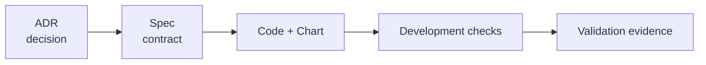

# ShiftPV Documentation

문서는 네 가지 질문에 답한다.

```text
docs/
├── adr/          Why was the architecture selected?
├── spec/         What does the current product guarantee?
├── development/  How is the product changed and tested?
└── validation/   What ran, where, and with what result?
```

| 영역 | 내용 규칙 | Index |
|---|---|---|
| ADR | 구조적 결정 하나; `Context → Decision → Alternatives → Consequences` | [adr/](adr/README.md) |
| Spec | 현재 binary와 chart 계약 | [spec/](spec/README.md) |
| Development | source 경계와 반복 가능한 검사 | [development/](development/README.md) |
| Validation | commit과 환경에 결합된 실행 증거 | [validation/](validation/README.md) |



현재 동작은 Spec, 실행 명령은 Development 또는 Helm guide가 소유한다. 날짜별 결과는 Validation
snapshot으로 보존한다. 정식 release 전 사실 교정은 결정의 의미를 유지하며 기존 ADR에 반영한다.
