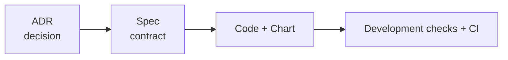

# ShiftPV Documentation

문서는 현재 제품에 대한 세 가지 질문에 답한다. 설치와 운영 절차는 Helm chart가 소유한다.

```text
docs/
├── adr/          Why was the architecture selected?
├── spec/         What does the current product guarantee?
└── development/  How is the product changed and tested?
```

| 영역 | 내용 규칙 | Index |
|---|---|---|
| ADR | 구조적 결정 하나; `Context → Decision → Alternatives → Consequences` | [adr/](adr/README.md) |
| Spec | 현재 binary와 chart 계약 | [spec/](spec/README.md) |
| Development | source 경계와 반복 가능한 검사 | [development/](development/README.md) |
| Operations | 설치, 설정, upgrade와 제거 | [Helm chart guide](../charts/shiftpv/README.md) |



현재 동작은 Spec, 개발 검증은 Development, 설치와 운영은 Helm guide가 소유한다. 현재 commit의 판정은
required CI job으로 확인한다. 정식 release 전 사실 교정은 결정의 의미를 유지하며 기존 ADR에 반영한다.
