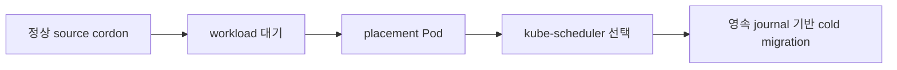

# 0007. 정상 cordon 이동은 Kubernetes 배치와 협력한다

- 상태: Accepted
- 날짜: 2026-09-02
- 관련 결정: [이동 전 사전 점검](0008-nondisruptive-mobility-preflight.md)
- 상세 계약: [volume mobility](../spec/volume-mobility.md)

## Context

한 node에 authoritative data가 있는 volume을 정비 중 옮기면서 PVC/PV identity와 workload
controller의 책임을 유지해야 한다. CSI에는 MoveVolume RPC가 없고 drain은 migration 완료를
기다리지 않는다.

## Decision

ShiftPV는 배치 요청과 volume transaction을 조정한다. kube-scheduler가 destination을 선택하고,
workload controller가 replica를 소유한다. Commit 전 source, commit 후 destination이 유일한 owner다.

이동 판단은 외부 I/O와 분리한 FSM이 담당한다. Controller는 관찰·action 실행·journal 기록을
조정하고, helper는 지시받은 파일 작업의 결과를 제공한다. 재시작 후 영속 상태를 관찰해 진행한다.
정리 완료 증거는 잠금 해제보다 먼저 기록한다. 파일 작업의 완료와 transaction 종결을 분리해
API 갱신 사이의 중단에도 완료 기록을 재시도한다.

원본 정리 요청은 Move와 별도 수명을 갖는 영속 기록으로 남긴다. 이동 controller가 삭제 권한과
완료를 확인하고, helper가 승인된 경로의 파일 작업을 실행한다. 기존 Kubernetes ConfigMap을
요청 저장소로 사용하며, 요청 분리가 이동 잠금의 조기 해제를 의미하지 않는다.
정리 요청의 관찰·종결 책임은 같은 controller 안에서 분리한다. 불명확한 잔여 데이터는 운영자에게
확인 책임을 넘기고, 실제 경로 부재를 읽기 전용으로 검증한 뒤 정리 의무를 종료한다.

## Alternatives considered

| 대안 | 절충점 |
|---|---|
| MutablePVNodeAffinity | alpha 기능과 장기 지원 경계에 의존한다. |
| custom scheduler/plugin | cluster-wide 구성과 결합도가 커진다. |
| workload replica/template 직접 변경 | GitOps와 workload controller의 소유권이 겹친다. |
| helper가 다음 이동 단계까지 결정 | 파일 작업과 authority 판단의 소유권이 겹친다. |

## Consequences

자동 이동은 정상 source와 지원 가능한 단일-consumer workload에 적용한다. Cordon은 이동 신호이며,
운영자는 이동 완료를 확인한 뒤 drain을 진행한다.
