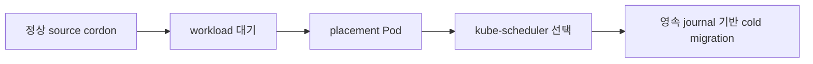

# 0007. 정상 cordon 이동은 Kubernetes 배치와 협력한다

- 상태: Accepted
- 날짜: 2026-09-02
- 관련 결정: [이동 전 사전 점검](0008-nondisruptive-mobility-preflight.md)
- 상세 계약: [volume mobility](../spec/volume-mobility.md)

## Context

한 node에 authoritative data가 있는 volume을 정비 중 옮기면서 PVC/PV identity와 workload
controller의 책임을 유지해야 한다. CSI에는 MoveVolume RPC가 없고 drain은 migration 완료를
기다리지 않는다.

## Decision

ShiftPV는 배치 요청과 volume transaction을 조정한다. kube-scheduler가 destination을 선택하고,
workload controller가 replica를 소유한다. Commit 전 source, commit 후 destination이 유일한 owner다.

이동 판단은 외부 I/O와 분리한 FSM이 담당한다. Controller는 관찰·action·journal을 조정하고,
node-bound helper는 exact copy identity로 제한된 파일 작업만 실행한다. 재시작은 CR journal을 다시
관찰해 진행한다.

원본 삭제는 Move와 수명이 분리된 immutable `ShiftPVCleanup` 계약으로 실행한다. Node가 bounded
inventory를 보고하고 Controller가 live authority로 삭제 여부를 판정하며 Helper가 local marker와
inode를 검증한다. Purged receipt가 정산된 뒤 Move 잠금을 해제한다. Authority가 불명확한 copy는
삭제하지 않고 `NeedsReview`로 보존한다.

## Alternatives considered

| 대안 | 절충점 |
|---|---|
| MutablePVNodeAffinity | alpha 기능과 장기 지원 경계에 의존한다. |
| custom scheduler/plugin | cluster-wide 구성과 결합도가 커진다. |
| workload replica/template 직접 변경 | GitOps와 workload controller의 소유권이 겹친다. |
| helper가 다음 이동 단계까지 결정 | 파일 작업과 authority 판단의 소유권이 겹친다. |
| 경로와 나이만으로 orphan 삭제 | 다른 설치·Pool·Volume의 데이터를 채택할 수 있다. |

## Consequences

자동 이동은 정상 source와 지원 가능한 단일-consumer workload에 적용한다. Cordon은 이동 신호이며,
운영자는 이동 완료를 확인한 뒤 drain을 진행한다.
