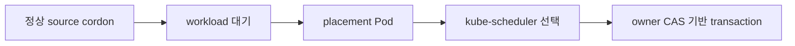

# 0007. 정상 cordon 이동은 Kubernetes 배치와 협력한다

- 상태: Accepted
- 날짜: 2026-09-02
- 적용 범위: 0.4 target contract
- 관련 결정: [이동 전 사전 점검](0008-nondisruptive-mobility-preflight.md)
- 상세 계약: [volume mobility](../spec/volume-mobility.md)

## Context

한 node에 authoritative data가 있는 volume을 정비 중 옮기면서 PVC/PV identity와 workload
controller의 책임을 유지해야 한다. ShiftPV의 범위는 planned cold mobility이며, 영구 node/disk 손실이나
automatic failover를 보증하지 않는다.

## Decision

ShiftPV는 배치 요청과 volume transaction을 조정한다. kube-scheduler가 destination을 선택하고,
workload controller가 replica를 소유한다. Commit 전 source, commit 후 destination이 유일한 owner다.
유일한 commit point는 `ShiftPVVolume` owner compare-and-swap이다. Commit 전 abort는 source로 수렴하고,
commit 후 failure는 destination으로 roll-forward한다.

이동 판단은 외부 I/O와 분리한 FSM이 담당한다. Controller는 관찰·action·parent journal을 조정하고,
node-bound helper는 exact copy identity로 제한된 파일 작업만 실행한다. Ephemeral Job은 실행 수단일
뿐 truth가 아니다. 재시작은 CR journal, finalizer, fresh Pool observation을 다시 관찰해 진행한다.

Source purge는 destination이 실제로 published 되었음을 증명한 뒤에만 시작한다. Purge release는 API
purge receipt와 post-receipt generation-fenced absence observation이 모두 필요하다. Parent-owned cleanup
identity가 불명확하면 cleanup subjournal `NeedsReview`로 멈추고, unknown orphan은 report-only로 보존한다.

## Alternatives considered

| 대안 | 절충점 |
|---|---|
| MutablePVNodeAffinity | alpha 기능과 장기 지원 경계에 의존한다. |
| custom scheduler/plugin | cluster-wide 구성과 결합도가 커진다. |
| workload replica/template 직접 변경 | GitOps와 workload controller의 소유권이 겹친다. |
| helper가 다음 이동 단계까지 결정 | 파일 작업과 authority 판단의 소유권이 겹친다. |
| 경로와 나이만으로 orphan 삭제 | 다른 설치·Pool·Volume의 데이터를 채택할 수 있다. |
| Job 상태를 truth로 사용 | controller restart와 TTL cleanup 뒤 transaction 사실이 사라진다. |

## Consequences

자동 이동은 정상 source와 지원 가능한 단일-consumer workload에 적용한다. Cordon은 이동 신호이며,
운영자는 이동 완료를 확인한 뒤 drain을 진행한다. Node가 다시 살아나면 transaction은 마지막 확정
journal에서 재개하거나 안전하게 보존된다.
