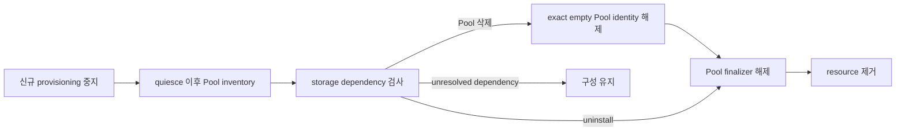

# 0011. Storage dependency 해소 후 제거한다

- 상태: Accepted
- 날짜: 2026-09-03
- 적용 범위: 0.4 target contract
- 운영 절차: [Helm chart](../../charts/shiftpv/README.md#uninstall)

## Context

Chart 밖에서 수명주기를 갖는 PVC, PV, ShiftPV resource와 host data는 release 제거 뒤에도 남는다.
Driver가 먼저 사라지면 mount, Move, cleanup, capacity hold의 수렴 경로도 사라진다.

## Decision

Helm pre-delete guard와 Kubernetes API deletion validation이 같은 dependency 정책을 집행한다. Uninstall은
unresolved `ShiftPVVolume`, `ShiftPVMove`, cleanup intent, owner hold, Move hold, Pool identity hold가 하나라도
있으면 실패한다.

Controller는 Pool에 protection finalizer를 둔다. 삭제가 요청된 Pool은 즉시 신규 provisioning·이동 대상에서
빠지고, node observation은 계속된다. Controller는 deletion timestamp 이후의 fresh·valid·complete inventory와
exact Pool UID 참조가 모두 빈 것을 확인한 뒤 해당 UID의 identity 해제를 승인한다. Node는 filesystem lock
안에서 managed data와 marker가 빈 것을 다시 확인하고 exact Pool identity marker만 해제해
`IdentityReleased` 상태를 기록한다. Controller는 이 상태를 확인한 뒤 finalizer를 해제한다.

Unknown orphan은 report-only dependency다. ShiftPV는 설치·Pool·Volume·Move identity가 모호한 path를 자동
삭제하지 않는다. Emergency bypass는 운영자가 보존 데이터와 복구 책임을 명시적으로 인수하는 별도 절차다.

## Alternatives considered

| 대안 | 절충점 |
|---|---|
| Helm hook 단독 | GitOps 삭제 순서에서 보호 resource가 먼저 사라질 수 있다. |
| object finalizer 단독 | 전체 driver와 RBAC 제거 순서를 표현하지 못한다. |
| 즉시 제거 | retained data의 mount 경로가 함께 사라진다. |
| unknown orphan 자동 삭제 | 다른 설치나 수동 보존 데이터를 제거할 수 있다. |

## Consequences

정상 제거는 dependency가 해소된 cluster에서 Pool finalizer를 해제한 뒤 완료된다. 실패한 검사는
구성을 유지하고 controller가 protection을 복구한다. Fail-closed 정책은 제거 편의보다 data recovery path를
우선한다.
