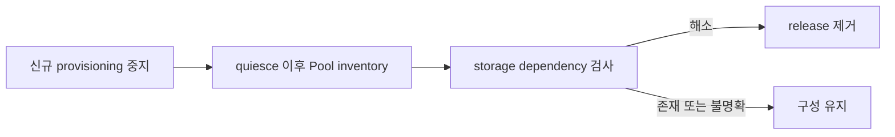

# 0011. Storage dependency 해소 후 제거한다

- 상태: Accepted
- 날짜: 2026-09-03
- 운영 절차: [Helm chart](../../charts/shiftpv/README.md#uninstall-and-recovery)

## Context

Chart 밖에서 수명주기를 갖는 PVC, PV, ShiftPV resource와 host data는 release 제거 뒤에도 남는다.
Driver가 먼저 사라지면 mount와 진행 중인 이동의 수렴 경로도 사라진다.

## Decision

Helm pre-delete guard와 Kubernetes API deletion validation이 같은 dependency 정책을 집행한다.
Lifecycle validation은 chart resource, ShiftPV CRD와 `ShiftPVPool`, `ShiftPVVolume`, `ShiftPVMove`,
`ShiftPVCleanup` 삭제를 함께 보호한다. 신뢰된 controller identity만 정상 CSI 수명주기에서
Volume, Move, Cleanup을 정리한다. Pool 등록 해제는 exact Pool UID를 기준으로 fresh·valid·complete
inventory가 비어 있고 PV, reservation, Volume, 진행 중 Move, Cleanup 참조가 없을 때만 독립적으로
허용한다. 그 밖의 외부 삭제는 uninstall permit을 따른다.
부모 Move나 Volume이 사라져도 미완료 `ShiftPVCleanup`은 독립적인 storage dependency로 남는다.
Volume reservation도 orphan 발견과 exact cleanup 정산 사이의 공백을 닫는 dependency로 남는다.
모든 Pool은 quiesce acknowledgement 이후에 관측된 fresh·valid·complete inventory를 제공하며,
신뢰 가능한 post-quiesce inventory에서 실제 copy가 하나라도 남아 있으면 제거를 유지한다.
`Pending`, `Running`, `Verifying`, `NeedsReview`는 구성을 유지하며 receipt가 정산된 `Completed`만
dependency를 해소한다.
Emergency bypass는 운영자가 보존 데이터와 복구 책임을 명시적으로 인수하는 별도 절차다.

## Alternatives considered

| 대안 | 절충점 |
|---|---|
| Helm hook 단독 | GitOps 삭제 순서에서 보호 resource가 먼저 사라질 수 있다. |
| object finalizer 단독 | 전체 driver와 RBAC 제거 순서를 표현하지 못한다. |
| 즉시 제거 | retained data의 mount 경로가 함께 사라진다. |

## Consequences

정상 제거는 dependency가 해소된 cluster에서 완료된다. Helm과 Argo CD는 각 lifecycle에 맞는 guard
경로를 사용하며 emergency bypass 이후 복구는 cluster 운영자가 맡는다.
