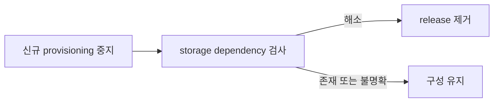

# 0011. Storage dependency 해소 후 제거한다

- 상태: Accepted
- 날짜: 2026-09-03
- 운영 절차: [Helm chart](../../charts/shiftpv/README.md#uninstall-and-recovery)

## Context

Chart 밖에서 수명주기를 갖는 PVC, PV, ShiftPV resource와 host data는 release 제거 뒤에도 남는다.
Driver가 먼저 사라지면 mount와 진행 중인 이동의 수렴 경로도 사라진다.

## Decision

Helm pre-delete guard와 Kubernetes API deletion validation이 같은 dependency 정책을 집행한다.
Emergency bypass는 운영자가 보존 데이터와 복구 책임을 명시적으로 인수하는 별도 절차다.

## Alternatives considered

| 대안 | 절충점 |
|---|---|
| Helm hook 단독 | GitOps 삭제 순서에서 보호 resource가 먼저 사라질 수 있다. |
| object finalizer 단독 | 전체 driver와 RBAC 제거 순서를 표현하지 못한다. |
| 즉시 제거 | retained data의 mount 경로가 함께 사라진다. |

## Consequences

정상 제거는 dependency가 해소된 cluster에서 완료된다. Helm과 Argo CD는 각 lifecycle에 맞는 guard
경로를 사용하며 emergency bypass 이후 복구는 cluster 운영자가 맡는다.
