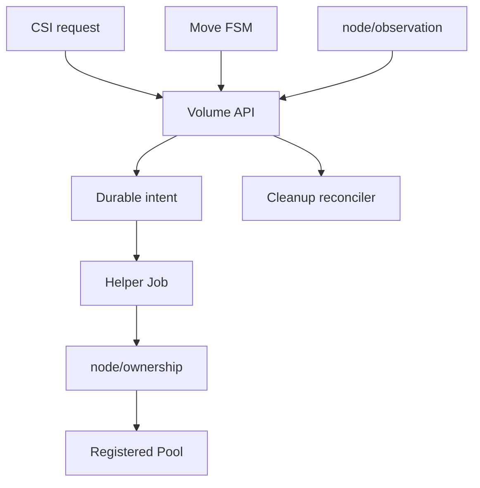

# Source Layout

`src/*`는 실행 경계보다 제품 책임을 먼저 드러낸다.

## Tree

```text
ShiftPV/
├── build/package/Dockerfile
├── charts/shiftpv/
│   ├── crds/
│   └── templates/
├── docs/{adr,spec,development}/
├── src/
│   ├── cmd/{controller,node,uninstall-guard,volume-helper}/
│   ├── csi/{controller,identity,node,server}/
│   ├── kubernetes/{cleanupapi,helperpod,volumeapi}/
│   ├── lifecycle/{admission,cleanupcontroller,uninstall}/
│   ├── metrics/
│   ├── mobility/{admission,controller,fsm}/
│   ├── node/{mount,observation,ownership}/
│   ├── pool/{capacity,readiness}/
│   ├── volume/
│   └── webhook/certificate/
└── test/{docs,e2e,helm,integration,release}/
```

## Responsibilities

| 경로 | 단일 책임 |
|---|---|
| `src/cmd/*` | flag, dependency wiring, process lifecycle |
| `src/csi/*` | CSI RPC와 mount authorization |
| `src/kubernetes/cleanupapi` | immutable Cleanup와 status transition |
| `src/kubernetes/helperpod` | node-bound filesystem effect Job |
| `src/kubernetes/volumeapi` | Pool, Volume, Move persistence |
| `src/lifecycle/cleanupcontroller` | observation → disposition → cleanup settlement |
| `src/lifecycle/admission`, `uninstall` | safe removal policy |
| `src/mobility/admission` | owner pin과 Placement Hold |
| `src/mobility/controller` | Move observation과 action orchestration |
| `src/mobility/fsm` | 외부 I/O 없는 state decision |
| `src/node/mount` | bind mount와 target boundary |
| `src/node/observation` | bounded Pool inventory |
| `src/node/ownership` | copy marker, inode, lock, transfer, reclaim |
| `src/pool/capacity` | statfs와 reservation admission |
| `src/pool/readiness` | node-local Pool probe |
| `src/metrics` | cached operational snapshot |
| `src/volume` | API 독립 ID, path, copy identity |
| `src/webhook/certificate` | admission TLS lifecycle |

## Control flow



| 검증 | 위치 |
|---|---|
| package behavior | 대상 package의 `*_test.go` |
| Kubernetes integration | `test/e2e/kind` |
| Linux mount / filesystem | `test/integration` |
| chart / release | `test/helm`, `test/release` |

상태 전이는 [Volume mobility](../spec/volume-mobility.md), 파일 정리는
[Cleanup and GC](../spec/source-cleanup.md)가 소유한다.
