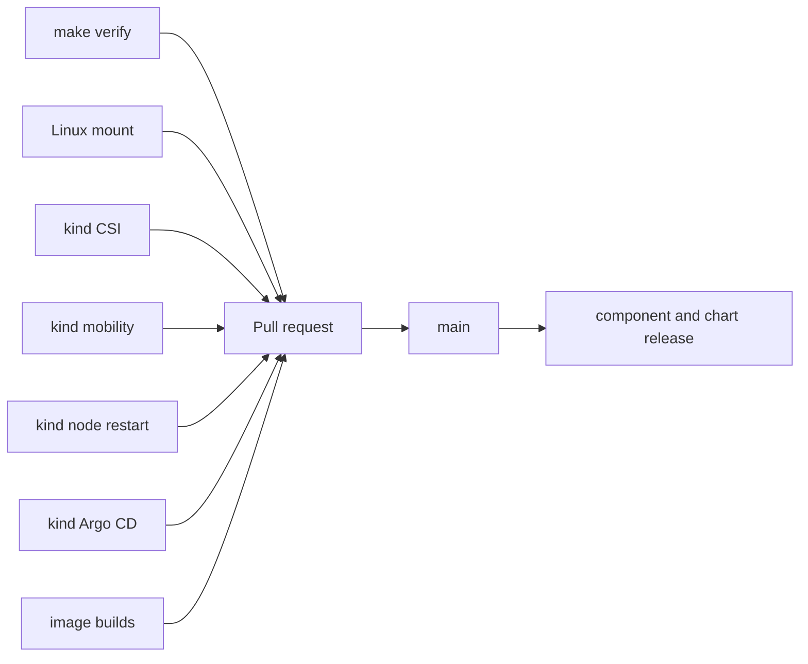
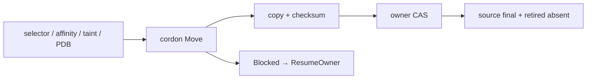

# Testing

모든 명령은 repository root에서 실행한다. Pull request는 required CI job이 모두 성공한 뒤 병합한다.

## Verification map



| 계층 | 명령 | 증거 |
|---|---|---|
| Fast | `make verify` | unit, race, coverage, vet, build, release logic, link, ShellCheck, Helm |
| Linux mount | `make linux-mount-integration` | 실제 bind mount namespace와 권한 경계 |
| CSI lifecycle | `./test/e2e/kind/run.sh` | provision, publish, capacity, fault, uninstall, reinstall |
| Mobility | `./test/e2e/kind/mobility/run.sh` | preflight, FSM, transfer, recovery, source purge |
| Argo CD | `./test/e2e/kind/argocd/run.sh` | Application PreDelete와 lifecycle admission |
| 공개 artifact | `./test/e2e/kind/artifact/run.sh` | 공개 chart SHA와 multi-arch image digest |

## Fast checks

```bash
make verify
```

| Gate | 계약 |
|---|---|
| Go | format, module integrity, race, vet, build |
| Coverage | 제품 package statement ≥ 80% |
| Shell | build/test script ShellCheck |
| Helm | lint와 deterministic template |
| Release | image/chart resolver 순서와 artifact lock |
| Docs | local Markdown link와 ADR 번호·인덱스·목차 일관성 |

Coverage artifact는 `.tmp/coverage.out`과 `.tmp/coverage.txt`에 생성된다.

Unit test는 다음 고비용 경계를 포함한다.

| Domain | 주요 경계 |
|---|---|
| CSI | capacity, topology, parameter, 멱등 create/delete, publish authorization |
| Pool | directory/write/statfs readiness, freshness, reservation, concurrent admission |
| Mobility | 전체 phase closure, CAS, API response loss, diagnostics, recovery, source purge |
| Lifecycle | dependency 검사, quiesce, read-only admission, provisioning drain |
| Certificate | 최초 발급, 갱신, CA 전환, Secret 복구, hot reload |
| Chart | kubelet root, component 경계, StorageClass, webhook mode |

## kind E2E

각 실행은 격리된 cluster, kubeconfig와 host directory를 만든다. 서로 다른 `CLUSTER_NAME`으로
suite를 병렬 실행한다. 성공과 실패 모두 소유 resource를 정리하며 `KEEP_CLUSTER=1`은 진단을 위해
cluster를 보존한다.

```text
kind control-plane
├── worker A ── Pool A
└── worker B ── Pool B
```

| Scenario | 검증 |
|---|---|
| Directory Pool | 기존 non-mount directory에서 provision, write, move, cleanup |
| Capacity | 외부 사용량과 reservation으로 신규 claim 제어, 해제 용량 단일 반환 |
| StorageClass | default와 명시 선택의 결정적 공존 |
| Restart | Controller/Node 교체 뒤 mounted data와 republish checksum 보존 |
| Filesystem fault | ENOSPC/read-only에서 data 보존과 복구 뒤 수렴 |
| Lifecycle | mounted/retained dependency 제거 차단과 reinstall 복구 |

집중 실행:

| 범위 | 명령 |
|---|---|
| Pool capacity | `POOL_CAPACITY_ONLY=1 CLUSTER_NAME=shiftpv-capacity-focused ./test/e2e/kind/run.sh` |
| 일반 directory | `DIRECTORY_POOL_ONLY=1 CLUSTER_NAME=shiftpv-directory-focused ./test/e2e/kind/run.sh` |
| Mobility filesystem fault | `MOBILITY_FILESYSTEM_FAULTS_ONLY=1 CLUSTER_NAME=shiftpv-mobility-fs-focused ./test/e2e/kind/run.sh` |
| Mobility node restart | `MOBILITY_NODE_RESTARTS_ONLY=1 CLUSTER_NAME=shiftpv-mobility-node-restart-focused ./test/e2e/kind/run.sh` |

### Mobility suite

```bash
./test/e2e/kind/mobility/run.sh
```



| 증거 | 검증 |
|---|---|
| Identity | PVC UID, PV, volume handle 유지 |
| Data | checksum 유지 |
| Placement | persisted destination에서 replacement 실행 |
| Authority | destination이 Ready owner, `activeMove`는 빈 값 |
| Cleanup | destination final 존재, source final/retired 부재 |
| Restart | Copying, Promoting, Committing 중 Controller 교체 수렴 |
| TLS | Secret key, owner reference, CA bundle, disable/enable 정책 수렴 |

### Node restart suite

집중 node suite는 이동의 여섯 경계에서 실제 Kind worker container를 중지한다.

| 중단 지점 | Authority 결과 | 복구 |
|---|---|---|
| commit 전 source | source owner 유지 | source 복귀 뒤 `ResumeOwner` |
| commit 전 destination | source owner 유지 | destination 복귀 뒤 같은 Move 재개 |
| commit 후 destination | destination owner 유지 | 복귀 뒤 publish와 source cleanup 재개 |

### Argo CD suite

```bash
./test/e2e/kind/argocd/run.sh
```

고정 버전 Argo CD를 전용 cluster에서 실행한다. Dependency가 없는 Application 삭제, mounted volume
차단, resource 보존, blocker 해소 뒤 자동 완료를 검증한다.

## Linux mount integration

```bash
make linux-mount-integration
```

Linux 전용 runner는 `sudo`와 util-linux `unshare`를 사용한다. Private namespace에서 bind publish,
멱등성, unpublish와 unprivileged failure cleanup이 source를 보존하는지 검증한다.

## CI

[`ci.yaml`](../../.github/workflows/ci.yaml)은 pull request, `main`, manual dispatch에서 실행된다.

| Job | 범위 |
|---|---|
| `verify` | fast check와 coverage artifact |
| `linux-mount` | 실제 mount namespace |
| `kind-e2e` | CSI, Pool, capacity, filesystem, lifecycle |
| `kind-mobility-e2e` | 자동 이동과 Controller restart |
| `kind-mobility-node-restart-e2e` | source/destination node 중단 경계 |
| `kind-argocd-e2e` | Argo CD 삭제 수렴 |
| `image-controller` | Controller/uninstall-guard image 경계 |
| `image-node` | Node image 경계 |

## Images and releases

```bash
make image
make image-controller CONTROLLER_VERSION=0.2.0
make image-node NODE_VERSION=0.1.3
make image-combined
```

| Version source | Artifact | Release tag |
|---|---|---|
| `versions/controller` | `ghcr.io/cagojeiger/shiftpv-controller:<version>` | `controller/v<version>` |
| `versions/node` | `ghcr.io/cagojeiger/shiftpv-node:<version>` | `node/v<version>` |
| `charts/shiftpv/Chart.yaml` | Helm repository package | `chart/v<version>` |

Controller와 Node image는 해당 version file이 바뀐 `main` CI 성공 뒤 독립적인 `linux/amd64`,
`linux/arm64` manifest를 공개한다. Chart는 참조 image의 공개를 확인한 뒤 배포된다. Combined image는
Kind 검증용이며 독립 제품 버전 대신 component 버전을 담는다.

## Published artifact smoke

```bash
./test/e2e/kind/artifact/run.sh
```

Smoke test는 GitHub Pages chart와 [`versions.env`](../../test/e2e/kind/artifact/versions.env)의
digest-pinned 공개 image를 설치한다. PR CI는 lock 형식과 불변성을 검사하고 scheduled/manual workflow는
동적인 공개 가용성과 배포된 upgrade 경로를 검증한다.

날짜별 실행 결과는 commit CI를 보완한다. [Validation evidence](../validation/README.md)에서 확인한다.
