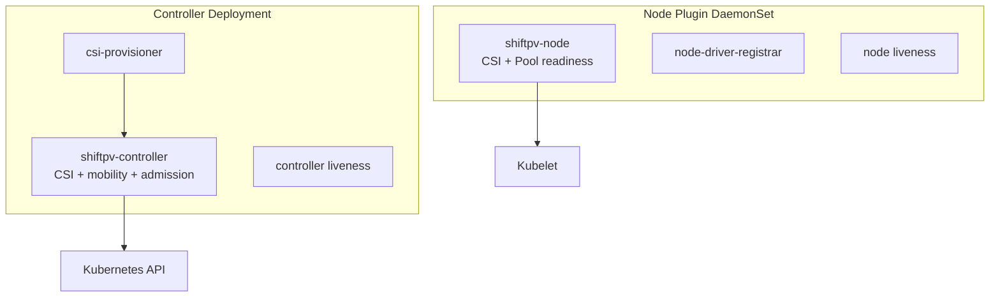
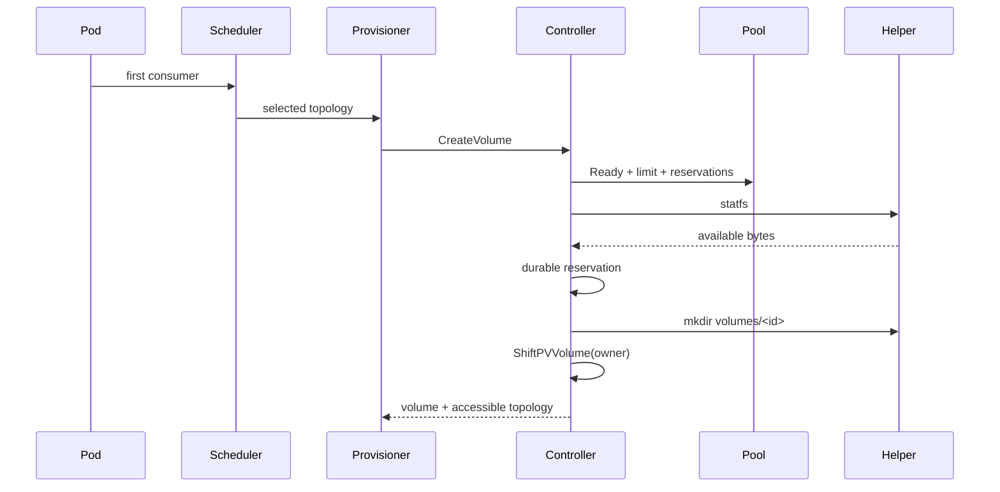
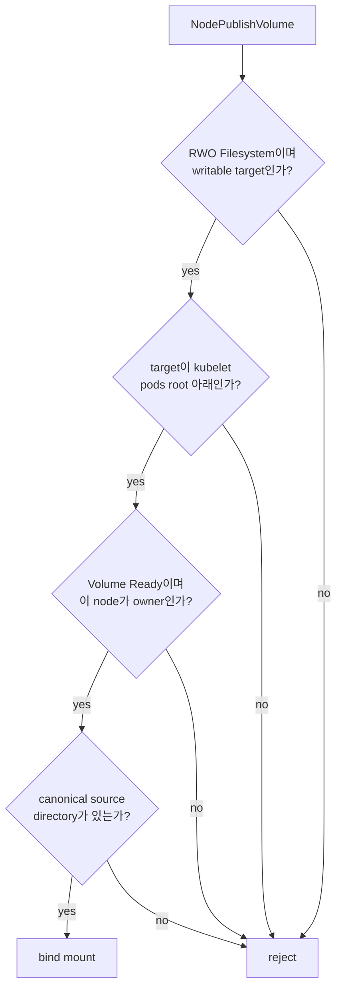

# CSI Driver Contract

`csi.shiftpv.io`는 Kubernetes PVC lifecycle을 등록된 `ShiftPVPool` 안의 directory와 연결한다.

## Components



| 속성 | 값 |
|---|---|
| Driver | `csi.shiftpv.io` |
| Lifecycle | Persistent |
| Attach | `false` |
| Topology key | `topology.csi.shiftpv.io/node` |
| Node ID | Kubernetes node name |
| Controller socket | `/run/csi/csi.sock` |
| Node socket | `<kubeletRootDir>/plugins/csi.shiftpv.io/csi.sock` |

한 Helm release가 선택한 node는 하나의 `node.kubeletRootDir`을 공유한다.

| Kubernetes 구성 | `node.kubeletRootDir` |
|---|---|
| 일반 kubelet | `/var/lib/kubelet` |
| MicroK8s | `/var/snap/microk8s/common/var/lib/kubelet` |

## RPC surface

| Service | RPC |
|---|---|
| Identity | `GetPluginInfo`, `GetPluginCapabilities`, `Probe` |
| Controller | `CreateVolume`, `DeleteVolume`, `ControllerGetCapabilities`, `ValidateVolumeCapabilities` |
| Node | `NodeGetInfo`, `NodeGetCapabilities`, `NodePublishVolume`, `NodeUnpublishVolume` |

광고하는 RPC와 capability가 제품 경계다. Attach, stage/unstage, resize, snapshot, stats, raw block과
RWX는 현재 제품 범위 밖이다.

## Provisioning



| 단계 | 영속 결과 |
|---|---|
| Identity | request name의 SHA-256으로 filesystem-safe volume ID 생성 |
| Readiness | 선택한 Pool의 `Accessible`, `Writable`, `CapacityReadable`, `Ready`가 현재 상태 |
| Capacity | requested bytes가 Pool reservation과 filesystem 여유를 모두 충족 |
| Reservation | `<volume-id>` ConfigMap에 request, node, capacity를 멱등 기록 |
| Directory | node-bound helper가 `<mountPath>/volumes/<volume-id>` 생성 |
| Authority | `ShiftPVVolume.status.ownerNode`에 최초 owner 기록 |
| Topology | mobility namespace는 등록 Pool node, 일반 namespace는 owner node 기록 |

Pool 설정이나 capacity가 불명확하면 directory 생성 전에 admission을 닫는다. Kubernetes API
throttling, timeout, unavailable은 재시도 가능한 `Unavailable`로 변환하고 request cancellation은
원래 gRPC status를 유지한다.

## Pool contract

```text
host /
└── <ShiftPVPool.spec.mountPath>/
    ├── volumes/<volume-id>/
    └── .shiftpv/
```

| 규칙 | 결과 |
|---|---|
| 기존 absolute non-root directory | Pool candidate |
| 현재 node에 Pool 하나 | owner 경계가 단일함 |
| directory access 성공 | `Accessible=True` |
| 임시 쓰기, sync, cleanup 성공 | `Writable=True` |
| filesystem `statfs` 성공 | `CapacityReadable=True` |
| 모든 최신 condition 성공 | `Ready=True` |
| condition 실패 또는 stale | 신규 provisioning과 destination 선택 대기 |

Pool path는 immutable이고 node마다 다를 수 있다. Node Plugin은 `/host` mount에서 정확한 path를
해석한다. 운영자가 directory와 filesystem lifecycle을 소유하고 chart와 Controller는 기존
directory를 사용한다.

## Publish authorization



`NodePublishVolume`은 요청마다 현재 `ShiftPVVolume` authority를 읽는다. Moving, Blocked, unknown,
non-owner 상태는 즉시 publication을 닫는다. Placement coordination은 owner commit 뒤 destination
Pod를 해제한다. CSI 호출은 bounded이며 polling loop나 Kubernetes watch를 소유하지 않는다.

성공한 publish/unpublish는 `publishedNodes`를 갱신한다. Per-volume serialization과 실제 mount
reference로 Pod 교체 중 겹치는 kubelet target을 처리한다. Owner field가 authority의 source of
truth다.

Node Plugin은 host root를 `HostToContainer`, kubelet target을 `Bidirectional` propagation으로
mount한다. Node Plugin 재시작 전후 host와 plugin mount namespace가 일치한다.

## Idempotency and deletion

| 작업 상태 | Reconcile 결과 |
|---|---|
| 동일한 `CreateVolume` 재요청 | 같은 volume ID와 topology 반환 |
| 같은 reservation의 다른 request | `AlreadyExists` |
| reservation 또는 Volume 일부 생성 | 영속 상태에서 계속 진행 |
| 이미 published target | 성공 |
| 이미 unpublished target | 성공 |
| active Move가 없는 Ready volume | owner directory, reservation, Volume state 순서로 삭제 |
| Moving 또는 Blocked volume | data와 state 보존 |
| 재시도 가능한 directory 실패 | metadata를 보존하고 같은 단계 재시도 |
| reservation과 Volume 모두 없음 | 삭제 완료 |

Volume별 Create/Delete와 Pool별 capacity admission은 직렬화한다. 서로 다른 Pool은 독립적으로
진행한다. Chart는 Controller replica를 하나로 고정한다.

StorageClass의 `Retain` 정책에 따라 일반 PVC 삭제는 복구 가능한 Released PV를 남긴다. 운영자가
retained data를 정리한 뒤 명시적 retirement 경로가 CSI deletion을 호출한다.

## Performance boundary

```text
정상 I/O: Pod ↔ bind mount ↔ Pool filesystem ↔ device
이동:     source Pool ↔ authenticated rsync ↔ destination Pool
```

정상 I/O의 throughput, latency와 durability는 Pool filesystem, device, mount option, encryption과
workload pattern을 따른다. CSI lifecycle 측정은 provisioning과 republish를 포함한다. 이동 측정은
dataset size, file count, cache state, network와 destination publish time도 함께 기록한다. 환경별 측정값은
제품 SLO로 간주하지 않는다.
