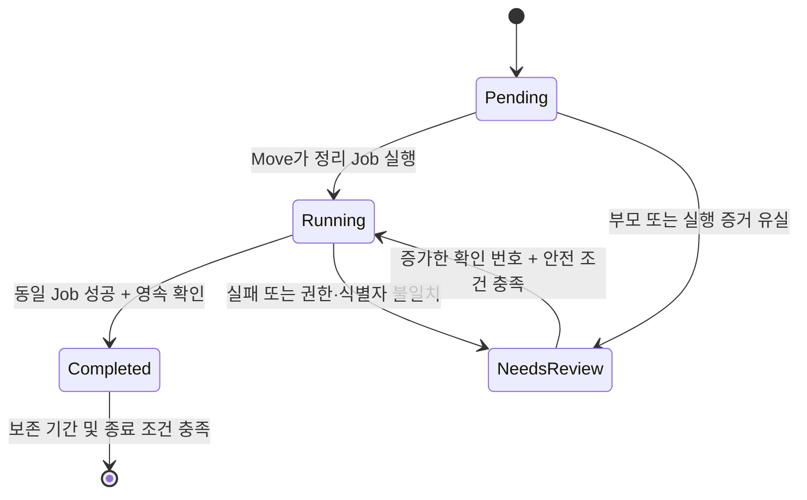

# Source cleanup

## Responsibility

```text
Move controller ── 승인된 삭제 요청 ── source cleanup Job
      │                                    │
      └── 완료 증거 저장 ←──────────────────┘
               │
       Completing → 이동 잠금 해제

Cleanup lifecycle ── 요청 상태 관찰·보존 기간 관리
      └── 운영자 확인 요청 → read-only path check → 완료 증거
```

| 담당 | 계약 |
|---|---|
| Move | source/destination authority, 최초 삭제 실행과 이동 잠금 |
| Cleanup lifecycle | 기존 controller 안에서 정리 요청 수명주기 조정 |
| `shiftpv-cleanup-check` | 정해진 경로의 `lstat` 결과 확인; 파일 변경 없이 종료 |
| Uninstall guard | 미완료·손상된 요청이 있으면 구성 유지 |

## Request and states

요청은 controller namespace의 `shiftpv.io/cleanup-request=source-v1` ConfigMap이다.
`data.intent`는 immutable이며 Move 이름·UID, volume ID, source/destination, Pool 경로, 최초 Job 이름·image를 묶는다.



| 상태 | 의미 |
|---|---|
| `Pending` | Move의 정리 실행 대기 |
| `Running` | 삭제 또는 읽기 전용 확인 진행 |
| `NeedsReview` | 서비스 복구·경로 점검·새 확인 요청 필요 |
| `Completed` | 실제 삭제 성공 또는 읽기 전용 부재 검증을 영속 기록 |
| `Unknown` | 손상된 요청을 metrics에서 표시; 요청과 uninstall 차단 유지 |

## Execution and recovery

| 경계 | 동작 |
|---|---|
| 최초 삭제 | 요청 저장 → 정확한 Job UID 연결 → 성공 확인 → 완료 기록 |
| 삭제 Job 예산 | backoff 2, active deadline 300s |
| 삭제 증거 | 저장된 image·UID·경로·명령·보안 설정·실행 예산이 일치할 때 성공 수용 |
| 연결된 삭제 Job 유실 | `CleanupFailed`로 Blocked; `ResumeOwner` 경로로 서비스 복구 |
| `ResumeOwner` 완료 | 서비스가 현재 owner에서 재개; 잔여 정리 의무는 별도로 유지 |
| 확인 요청 | `shiftpv.io/cleanup-check` annotation의 증가하는 양의 정수; uint64 범위 |
| 요청 멱등성 | 진행 중 번호와 Job UID·image 고정; 같은 번호나 과거 번호로 실패한 확인 재실행 차단 |
| 확인 Job 예산 | read-only mount, root filesystem read-only, capabilities 없음; backoff 0, active deadline 300s |
| 확인 실패·Job 유실 | `NeedsReview` 유지; 원인 해소 후 더 큰 번호로 요청 |
| 완료 기록 실패 | Job 증거 보존·API 재시도; 기록 성공 뒤 Job TTL 600s |

확인 시작과 결과 수용 시 다음 조건을 함께 확인한다.

| 대상 | 조건 |
|---|---|
| 원 Move | 동일 UID의 Succeeded 또는 Blocked/Recovered; API로 확인된 부재 허용 |
| Volume | active Move 없음, Ready인 유효 owner가 source 이외의 node; source publication 없음; API NotFound 허용 |
| Source | Ready Node와 Ready Pool, 등록 경로가 immutable intent와 일치 |
| 기존 helper | 원 Move와 recovery Job·Pod 종료; 최초 cleanup Job 부재 |
| 확인 증거 | 정확한 Job UID·요청 번호·image·실행 명령·경로·읽기 전용 설정 |

고정된 확인 경로:

```text
<Pool>/
├── volumes/<volumeID>
└── .shiftpv/
    ├── retired/<moveName>
    ├── incoming/<moveName>
    └── aborted/
        ├── <moveName>-final
        └── <moveName>-incoming
```

각 상위 경로의 directory·symlink 여부를 확인하고, `ENOENT`만 부재로 인정한다.
권한 오류·I/O 오류·symlink·남은 경로는 확인 실패다. 경로 수는 고정이며 재귀 용량 조사는 수행하지 않는다.
현재 등록된 filesystem에 대한 부재 확인이며, 운영자가 교체·분리한 과거 디스크의 폐기는 운영자 책임이다.

## Observation and retention

| 항목 | 값·조건 |
|---|---|
| Lifecycle 실행 | `mobility.enabled=true` |
| 관찰 | 1분 주기, pass 10s, 요청별 5s, 최대 32건씩 순환 |
| API 예산 | 잘못된 확인 번호는 authority 조회 전에 거부; uninstall polling은 별도 lifecycle admission client 사용 |
| API 갱신 | 관찰 내용이 바뀔 때 기록 |
| 완료 기록 보존 | 완료 시각부터 7일; 시각 없는 완료 기록은 첫 관찰부터 |
| 삭제 조건 | 원 Move 종결 또는 부재, Volume activeMove 없음, 증거 Job 부재, UID·resourceVersion 일치 |
| 미완료·손상 요청 | 기간과 무관하게 보존 |
| 지표 | `shiftpv_cleanup_requests{state}`; 실제 상태 반영은 lifecycle 및 metrics 관찰 주기의 영향 |

상세 운영 명령은 [Helm guide](../../charts/shiftpv/README.md#cleanup-review)가 소유한다.
