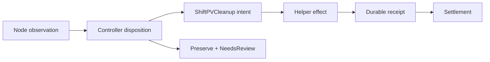
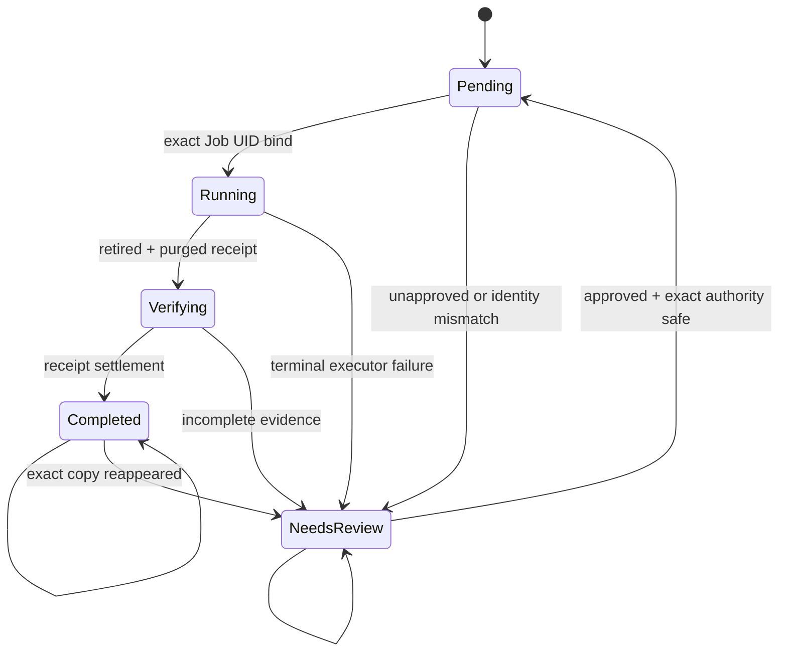

# Cleanup and GC Contract

ShiftPV GC는 임의의 directory를 지우는 수집기가 아니다. Node가 copy를 관찰하고 Controller가
삭제 권한을 판정하며, 승인된 exact copy만 Helper Job이 정리하는 보수적 수명주기다.

## Closed loop



| 단계 | 책임 | 영속 증거 |
|---|---|---|
| Observation | Node Plugin | `ShiftPVPool.status.inventory` |
| Disposition | Controller | live PV, Volume, Move, Pool, cluster identity와 mount observation |
| Intent | Controller | immutable `ShiftPVCleanup.spec` |
| Effect | node-bound Helper Job | local cleanup intent와 retired copy |
| Receipt | Helper | local receipt + `ShiftPVCleanup.status.receipt` |
| Settlement | Controller | `Completed`, `settledAt` |

## Exact copy identity

삭제 대상은 path 문자열이 아니라 다음 필드 전체로 식별한다.

| Field | Authority |
|---|---|
| `installationID` | `kube-system` Namespace UID 기반 cluster incarnation |
| `poolName`, `poolUID` | 등록된 `ShiftPVPool` incarnation |
| `volumeID`, `volumeUID` | CSI handle과 `ShiftPVVolume` incarnation |
| `copyID` | copy incarnation |
| `nodeName`, `role` | 물리 위치와 `Serving` / `Incoming` / `Retired` 역할 |

Node control marker는 copy identity와 directory의 device/inode를 함께 기록한다. Helper는 Pool lock을
잡은 뒤 API authority와 marker를 작업 전후에 다시 확인한다. Symlink, inode 교체, Pool 재등록,
설치 재생성, executor 교체는 삭제 권한으로 인정하지 않는다.

```text
<Pool>/
├── volumes/<volumeID>/
└── .shiftpv/
    ├── pool.json
    ├── incoming/<copyID>/
    ├── retired/<copyID>/
    ├── copy-<copyID>.json
    ├── placements/placement-<copyID>.json
    └── operation-{cleanup,receipt}-<operationID>.json
```

## Cleanup resource

`ShiftPVCleanup`은 cluster-scoped다. 대상·사유·권한·예약 identity는 immutable이며 `approved`만
`false`에서 `true`로 한 번 변경할 수 있다.

| Spec | 의미 |
|---|---|
| `operationID` | 재시도 전체에서 유지되는 효과 ID |
| `target` | exact copy identity |
| `reason` | `MoveSource`, `VolumeDelete`, `OrphanReclaim` |
| `authority` | 삭제를 허가한 `ShiftPVMove`, `ShiftPVVolume`, cluster `Namespace` identity |
| `reservationUID` | cleanup이 회수할 exact orphan reservation UID; reservation이 없거나 active volume 소유이면 빈 값 |
| `approved` | Helper 실행 허용 여부 |



| Phase | Controller 동작 |
|---|---|
| `Pending` | 승인된 요청의 결정적 Helper Job 생성 |
| `Running` | 같은 Job UID의 receipt 대기 |
| `Verifying` | operation, executor, retired, purged 증거 확인 |
| `Completed` | 파일 효과 종결; 재실행 없음, 동일 exact copy 재관측 시 review fence 복구 |
| `NeedsReview` | 데이터 보존; 사유와 조치 표시, 실행 전 orphan은 조건을 재평가 |

API timeout과 일시적인 조회 실패는 현재 phase에서 재시도한다. Pool/Job/executor identity 변경,
Job의 terminal failure, receipt 없는 성공은 `NeedsReview`로 수렴한다.
정산된 exact copy가 filesystem rollback 같은 외부 효과로 다시 관측되면 기존 receipt를 보존한 채
`CopyReappeared` review fence를 연다. 이전 삭제 권한은 재사용하지 않으며 자동 재삭제하지 않는다.

## Approval rules

| Reason | `approved` | 실행 전 live authority |
|---|---:|---|
| `VolumeDelete` | true | Volume이 동일 operation으로 `Deleting`에 고정되고 publication 없음, current copy 일치 |
| `MoveSource` | true | destination owner commit·publish 완료, source unpublish, Move UID·copy 일치 |
| `OrphanReclaim` | false → true | target이 current/in-flight copy가 아니고 Pool/inventory가 fresh·valid하며 실제 mount가 없고 reservation identity가 일치 |

Orphan은 자동 승인하지 않는다. 운영자가 `approved=true`로 바꾸면 Controller가 live authority를 다시
판정한다. 아직 mounted 상태거나 PV/Volume/Move가 나타나면 같은 요청을 `NeedsReview`로 보존하고,
조건이 안전해지면 실행 전 요청만 `Pending`으로 되돌려 같은 operation을 시작한다. 이미 executor가
결합된 `NeedsReview`는 자동 재개하지 않고 immutable executor·receipt를 운영 증거로 유지한다.

PV는 volume handle만 참조하므로 그 자체로 physical copy를 식별하지 못한다. 동일 Volume의
`currentCopy`가 target과 다른 유효한 identity를 가리키면 target은 superseded copy로 판정한다.
`currentCopy`가 없거나 모순되면 PV 유무와 관계없이 보존한다. `Recovered` Move는 권한을 반납하고,
아직 진행 중인 Move가 target을 참조하면 삭제를 차단한다.

```text
observe without write
  → preserve as unapproved
  → operator approves exact identity
  → re-evaluate live authority
  → retire and purge
  → release exact reservation
  → settle receipt
```

## Bounded observation

| 항목 | 계약 |
|---|---|
| 범위 | 등록된 각 Pool의 ShiftPV control marker와 관리 directory |
| 상한 | Pool당 최대 256 observations |
| 초과 | `inventory.truncated=true`; 누락을 부재 증거로 사용하지 않고 Pool을 신규 provisioning·이동 대상에서 제외 |
| 손상 marker·unrecorded path | `problem`으로 보고하고 보존 |
| 실제 kubelet publication | `published=true`; orphan 실행 차단 |
| API owner 없는 valid copy | unapproved `OrphanReclaim` + `NeedsReview` |
| 외부 directory | ShiftPV marker가 없으면 삭제 대상으로 채택하지 않음 |

256은 관찰과 신규 배치의 운영 상한이다. 정확히 256개는 완전하게 관찰할 수 있지만 257번째 copy 또는
unrecorded path가 확인되면 새 할당을 닫는다. 기존 exact cleanup은 계속 실행할 수 있어 상한 아래로
수렴할 수 있다. tail이 계속 가려지면 Pool 분리 또는 수동 검토가 필요하다.

## Removal boundary

Volume reservation과 `Pending`, `Running`, `Verifying`, `NeedsReview` cleanup은 uninstall
dependency다. Exact cleanup의 `Completed` 정산 뒤 reservation이 해제되어야 정리 의무가 해소된다.
완료된 대상이 `settledAt` 이후의 새 inventory에서 다시 관측되면 `NeedsReview`로 돌아가 제거를 다시 차단한다.
Uninstall guard는 provisioning quiesce 뒤의 fresh·valid·complete Pool inventory에서 copy가 0개인 것도
확인한다. 조건을 충족하지 않은 snapshot의 copy 목록은 부재 또는 존재의 최종 증거로 사용하지 않고
새 inventory를 기다린다. ShiftPV CR 삭제도 lifecycle admission 대상이며, 정상 CSI 정리를 수행하는
controller identity만 Volume, Move, Cleanup 삭제를 독립적으로 진행한다. Exact UID의 Pool은 최신의
빈 inventory와 해당 Pool을 가리키는 lifecycle 참조가 모두 없을 때만 등록 해제된다. Helm pre-delete와
Argo CD lifecycle admission은 같은 dependency 판정을 사용한다.

관측 지표는 [`metrics.md`](metrics.md), 전체 이동 순서는
[`volume-mobility.md`](volume-mobility.md), 운영 명령은
[Helm guide](../../charts/shiftpv/README.md)가 소유한다.
