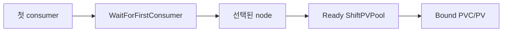
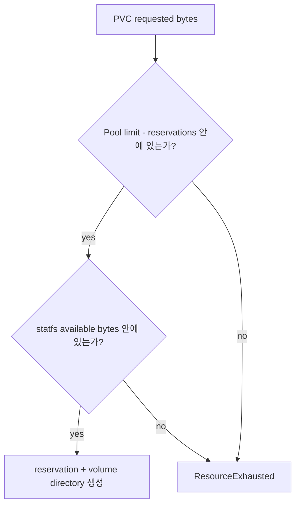

# StorageClass Contract

ShiftPV는 등록된 node Pool의 directory를 PVC로 동적 provisioning한다.



## Published class

```yaml
apiVersion: storage.k8s.io/v1
kind: StorageClass
metadata:
  name: shiftpv
provisioner: csi.shiftpv.io
reclaimPolicy: Retain
allowVolumeExpansion: false
volumeBindingMode: WaitForFirstConsumer
```

| 필드 | 계약 |
|---|---|
| Provisioner | `csi.shiftpv.io` |
| Access | `ReadWriteOnce` |
| Volume mode | `Filesystem` |
| Binding | `WaitForFirstConsumer` |
| Reclaim | `Retain` |
| Expansion | 현재 제품 범위 밖 |
| Parameters | external-provisioner metadata만 허용 |

알 수 없는 parameter는 `InvalidArgument`로 닫는다.

## Capacity admission



| 용량 신호 | 의미 |
|---|---|
| `ShiftPVPool.spec.capacity.limit` | ShiftPV가 Pool에 예약할 최대 PVC capacity |
| Active reservations | 현재 owner의 requested bytes + 승인된 incoming Move의 requested bytes |
| `statfs` availability | Pool이 속한 filesystem의 현재 available bytes |
| PVC capacity | reservation과 PV capacity의 기준값 |

신규 할당은 논리 잔여량과 물리 잔여량을 모두 충족한다. ShiftPV 밖의 writer도 `statfs`에
반영된다. 개별 volume 사용량은 filesystem 책임이며 Pool limit는 write quota가 아니라 admission
경계다. `statfs`는 검사 시점의 snapshot이며 공간을 예약하지 않는다. 검사 뒤 외부 writer가 공간을
소진해 directory 생성이 `ENOSPC`로 실패하면 reservation과 생성 intent를 보존하고 같은 CSI 요청을
재시도한다.

Pool copy inventory가 256 observations를 넘어 `truncated=true`이면 새 PVC와 이동 destination
admission을 닫는다. 기존 volume publish와 exact cleanup은 유지하며, inventory가 다시 완전해지면
신규 배치를 재개한다.

Incoming 예약은 `capacityApproved=true`, destination 일치, Volume의 `activeMove` 일치,
owner commit 전인 Move에 적용한다. Commit 뒤에는 destination owner 예약으로 한 번만 계산한다.
Volume과 reservation이 삭제된 완료 Move는 용량을 점유하지 않는다.

## Default-class selection

| Helm value | 새 PVC 동작 |
|---|---|
| `storageClass.defaultClass=false` | `storageClassName: shiftpv`를 명시한 workload가 선택 |
| `storageClass.defaultClass=true` | `storageClassName`이 없는 PVC가 ShiftPV 선택 |

cluster의 기본 StorageClass는 하나로 운영한다. 기존 PV는 원래 provisioner를 유지하며 별도
migration 절차를 따른다.

## Lifecycle

```text
PVC 삭제
   ↓
PV Released (Retain)
   ↓
운영자 복구 또는 명시적 PV/data 폐기
```

Helm은 StorageClass를 소유한다. PVC, PV, CR, reservation과 host data는 독립 lifecycle을 갖는다.
Pool 등록 해제는 해당 Pool의 실제 copy와 lifecycle 참조가 모두 해소된 뒤 허용된다.
Uninstall guard는 storage dependency 해소를 확인한 뒤 release 제거를 허용한다. 배포와 제거 절차는
[Helm chart guide](../../charts/shiftpv/README.md#uninstall-and-recovery)에 있다.
