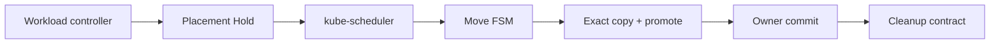
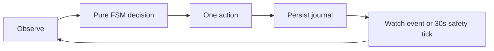
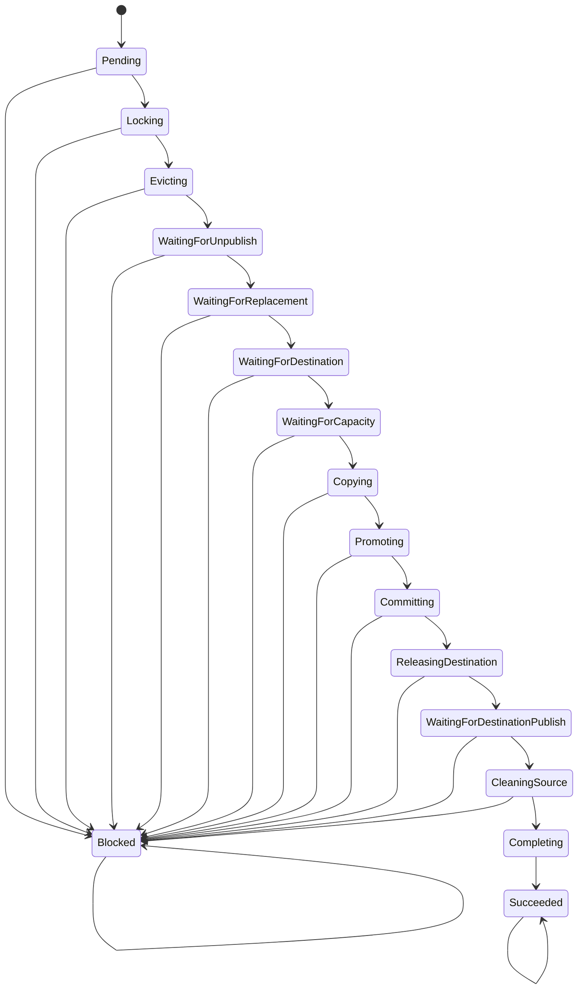
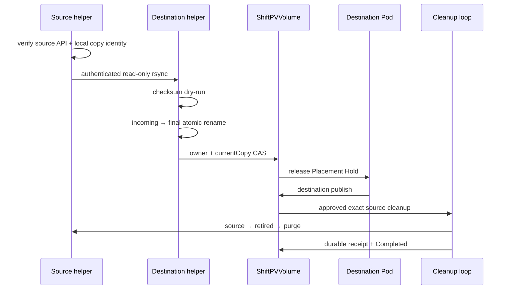
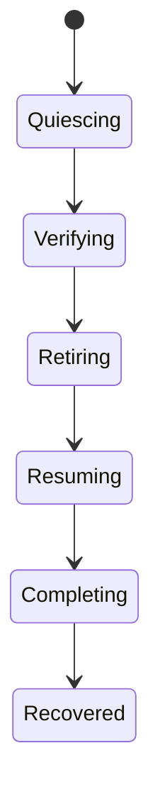

# Volume Mobility Contract

ShiftPV는 healthy owner node가 cordon되면 RWO Filesystem volume을 다른 등록 Pool로 cold migration한다.
PVC, PV, CSI volume handle은 유지하며 source I/O를 멈춘 뒤 copy한다.

## Responsibility



| 관심사 | 소유자 |
|---|---|
| replacement Pod와 replica | Deployment / StatefulSet controller |
| node 제약, resource fit | kube-scheduler |
| disruption 허용 | Eviction API와 PDB |
| Hold, copy, owner commit | ShiftPV Move FSM |
| source 삭제 | `ShiftPVCleanup` lifecycle |
| 정상 I/O | owner node의 CSI bind mount |

## Trigger and input

| 필수 입력 | 조건 |
|---|---|
| Volume | Bound RWO Filesystem, `Ready`, 빈 `activeMove` |
| Source | current owner Node와 Pool이 Ready이고 Node가 cordon |
| Consumer | controller-owned Pod 하나, ShiftPV PVC 하나 |
| Namespace | `shiftpv.io/admission=enabled` |
| Destination | schedulable Ready Pool 하나 이상, bounded inventory가 완전함 |

Cordon(`Node.spec.unschedulable=true`)이 이동 신호다. Pending/Unschedulable Pod status, unavailable source,
bare Pod, custom scheduler, 여러 consumer, 한 Pod의 여러 ShiftPV PVC는 자동 이동 입력이 아니다.

## Preflight and placement

| 검사 | 통과 조건 |
|---|---|
| Binding | PVC UID, PV claimRef UID, CSI handle 일치 |
| Workload | live owner UID와 template 일치 |
| Constraints | selector, required affinity, PV affinity에 맞는 candidate 존재 |
| Taints | source와 candidate가 현재 taint를 tolerate |
| PDB | 최신 generation이며 eviction allowance가 양수 |
| Scheduling model | Placement Hold와 reservation Pod로 표현 가능 |

Inter-Pod affinity, topology spread, resource claim, inline/ephemeral CSI는 자동 입력에서 제외한다.
Lock 전 보류는 원 Pod와 Ready owner를 유지한다. kube-scheduler는 Move UID가 소유한 reservation Pod를
배치하고, Controller는 선택된 node를 journal에 저장한다.

```text
workload owner → replacement Pod + Placement Hold
ShiftPV        → reservation Pod → scheduler-selected destination
owner commit   → reservation 제거 → destination pin → Hold 해제
```

## Authority model

| Resource | 단일 책임 |
|---|---|
| `ShiftPVPool` | node와 기존 Pool directory, readiness, bounded copy inventory |
| `ShiftPVVolume` | current owner, current copy, phase, publication, active Move |
| `ShiftPVMove` | source-to-destination transaction journal |
| `ShiftPVCleanup` | exact copy 삭제 intent, executor, receipt, settlement |

```text
commit 전  authoritative copy = source Serving copy
commit 후  authoritative copy = destination Serving copy
```

`activeMove`는 Volume lock이다. 최초 lock부터 source cleanup `Completed` 확인 뒤 최종 성공 처리까지
유지한다. Copy identity는 installation, Pool, Volume, copy, node, role의 incarnation 전체를 포함한다.

## Reconcile loop



| 결과 | 수렴 규칙 |
|---|---|
| API timeout / throttling | 같은 phase에서 재관찰 |
| action 응답 유실 | 결정적 이름, UID, CAS 결과를 read-back |
| 조건 미충족 | 현재 owner와 phase를 유지하며 대기 |
| terminal safety failure | `Blocked`; 자동 owner 변경 없음 |
| Controller 재시작 | CR journal과 Helper 리소스에서 재개 |

## Move FSM



### Transitions

| Phase | 완료 관찰 | Action |
|---|---|---|
| `Pending` | preflight 통과 | `LockVolume` |
| `Locking` | source owner + `Moving` + active Move | `EvictConsumer` |
| `Evicting` | 원 consumer 부재 | `Wait` |
| `WaitingForUnpublish` | source publication 부재 | `Wait` |
| `WaitingForReplacement` | held replacement 존재 | `EnsurePlacement` |
| `WaitingForDestination` | reservation이 Ready Pool에 배치 | `EnsureCapacity` |
| `WaitingForCapacity` | capacity 승인과 copy identities 영속화 | `EnsureCopy` |
| `Copying` | exact copy Job과 checksum 완료 | `EnsurePromotion` |
| `Promoting` | incoming을 destination Serving으로 atomic rename | `CommitOwner` |
| `Committing` | destination owner/Ready/currentCopy read-back | `DeletePlacement` |
| `ReleasingDestination` | reservation 부재 | `ReleasePlacement` |
| `WaitingForDestinationPublish` | destination publication 확인 | `EnsureCleanup` |
| `CleaningSource` | source cleanup `Completed` | `ConfirmCleanup` |
| `Completing` | destination authority 유지 또는 Volume NotFound | `MarkSucceeded` |
| `Succeeded` | terminal | `Wait` |
| `Blocked` | terminal; recovery journal은 별도 진행 | `Wait` |

### Actions

| Action | 효과 |
|---|---|
| `Wait` | 다음 관찰 대기 |
| `LockVolume` | source owner와 active Move CAS |
| `EvictConsumer` | Pod UID-bound Eviction API |
| `EnsurePlacement` | scheduler reservation 생성 |
| `EnsureCapacity` | logical/physical copy admission |
| `DeletePlacement` | exact reservation UID 삭제 |
| `ReleasePlacement` | destination pin과 Placement Hold 해제 |
| `EnsureCopy` | identities 영속화와 copy helper 요청 |
| `EnsurePromotion` | incoming promotion helper 요청 |
| `CommitOwner` | destination owner/currentCopy CAS |
| `EnsureCleanup` | approved exact source Cleanup 생성 |
| `ConfirmCleanup` | Cleanup `Completed` 확인 |
| `MarkSucceeded` | transfer resource 정리와 active Move 해제 |
| `MarkBlocked` | owner를 유지한 실패 journal 기록 |

### Execution boundary

Helper는 action의 파일 효과만 실행하며 다음 phase를 선택하지 않는다.

## Copy, commit and cleanup

```text
source       <source Pool>/volumes/<volumeID>/
incoming     <destination Pool>/.shiftpv/incoming/<incomingCopyID>/
destination <destination Pool>/volumes/<volumeID>/
retired      <source Pool>/.shiftpv/retired/<sourceCopyID>/
```



Transfer Secret, ConfigMap, source Pod, Service, copy Job과 promotion Job은 deterministic name과 exact
Move UID owner reference를 사용한다. 기존 이름의 다른 Move incarnation은 재사용하거나 삭제하지 않는다.
Source daemon은 현재 CSIDriver, Pool, Volume, Move, local Serving marker를 확인한 뒤 read-only rsync를 연다.
Destination helper는 API authority를 작업 전후 확인하고 volume lock 아래 copy/promotion을 실행한다.

Move capacity admission은 requested bytes의 논리 reservation과 source apparent bytes 대비 destination
filesystem available bytes를 함께 검사한다. 이는 copy admission이며 개별 PVC write quota나 filesystem
block 예약이 아니다. 승인 뒤 외부 writer가 공간을 소진해 copy가 실패하면 source authority와 data를
보존한 `Blocked/CopyFailed`로 끝난다. 공간 복구만으로 terminal Move를 재개하지 않으며 운영자가
`ResumeOwner` recovery를 요청한 뒤 새 이동 조건을 다시 평가한다.

Source 삭제의 상태·실패·orphan 판정은 [`source-cleanup.md`](source-cleanup.md)가 소유한다.

## Blocked recovery

`ResumeOwner`는 기록된 current owner만 다시 연다.

```bash
kubectl patch shiftpvmove <move-name> --type=merge \
  -p '{"spec":{"recovery":"ResumeOwner"}}'
```



| Recovery phase | 현재 동작 |
|---|---|
| `Quiescing` | exact Move UID의 helper Job/Pod 종료 확인 |
| `Verifying` | current owner Serving copy를 read-only로 검증 |
| `Retiring` | non-owner copy를 변경하지 않고 inventory/GC 검토 대상으로 보존 |
| `Resuming` | 같은 owner를 `Ready`로 CAS |
| `Completing` | owner publish와 recovery resource 정리 |
| `Recovered` | `activeMove` 해제, 같은 owner 유지 |

Source rollback은 수행하지 않는다. recovery가 current owner를 확정하면 non-owner copy는 Move 권한에서
분리되고 bounded inventory가 unapproved `OrphanReclaim` cleanup으로 `NeedsReview`에 수렴시킨다.
운영자 승인 뒤에도 current/in-flight identity, mount, Pool incarnation을 다시 확인한 exact copy만 삭제한다.

## Safety invariants

| 순서 | 불변식 |
|---:|---|
| 1 | Source unpublish 뒤 source daemon과 copy 시작 |
| 2 | Source와 incoming exact identity 확인 |
| 3 | checksum 완료 뒤 same-filesystem promotion |
| 4 | destination Serving identity 영속화 뒤 owner CAS |
| 5 | owner read-back 뒤 workload release |
| 6 | destination publish 뒤 source cleanup 승인 |
| 7 | purged receipt settlement 뒤 `activeMove` 해제 |
| 8 | 불명확한 identity는 data 보존과 `NeedsReview` |

## Limits

| 속성 | 현재 경계 |
|---|---|
| Controller | replica 1, `Recreate` strategy |
| Data model | single-owner planned cold migration |
| Waiting | 조건 기반; phase deadline 없음 |
| Source failure | unavailable-node failover 없음 |
| Replication, backup | 외부 시스템 |
| Scheduling | 지원 가능한 단일-consumer workload |

운영자는 이동 완료를 확인한 뒤 drain을 진행한다. 검증 방법은
[`development/testing.md`](../development/testing.md)에 있다.
