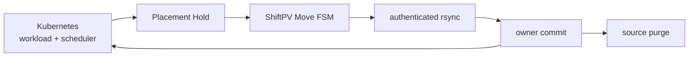
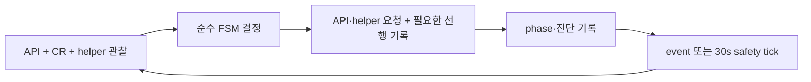
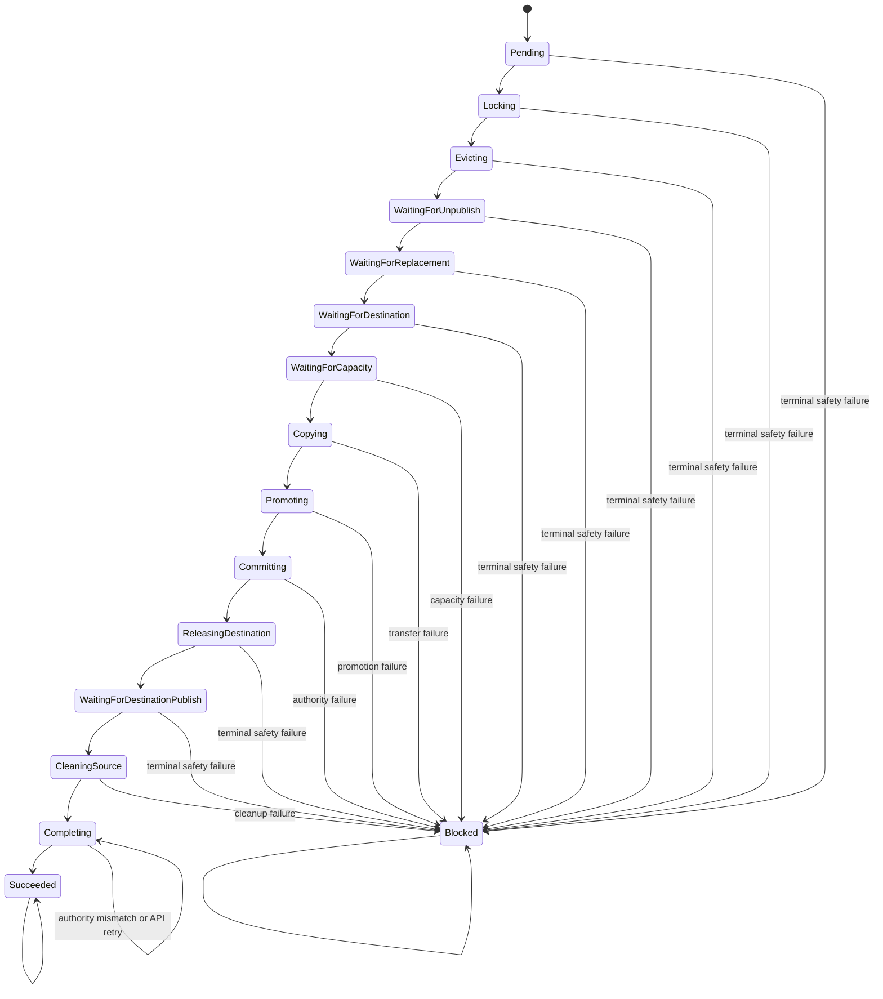
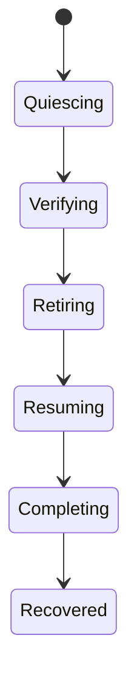
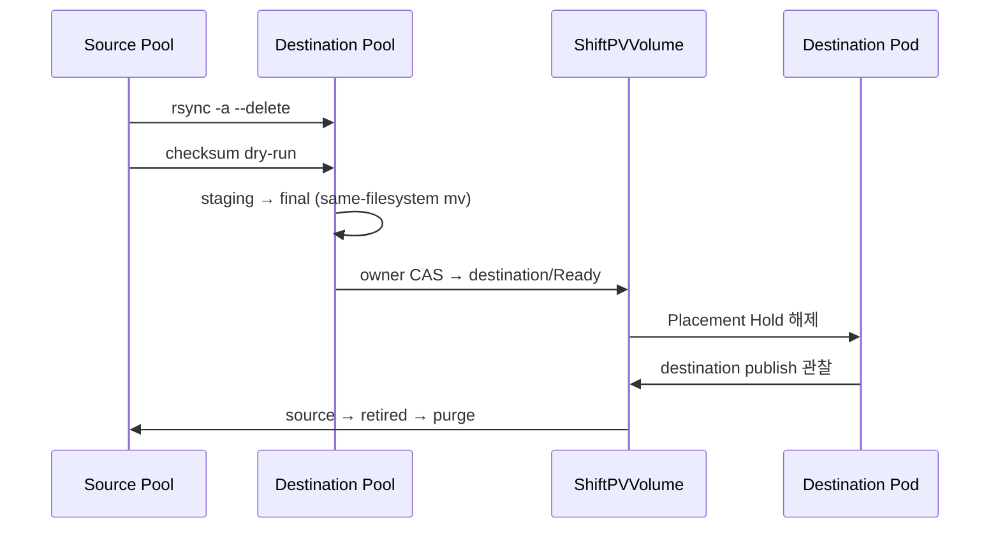

# Volume Mobility Contract

ShiftPV는 정상인 cordon owner의 authoritative directory를 다른 Pool로 옮긴다. PVC, PV와 CSI
volume handle은 유지하고 workload I/O를 멈춘 cold migration으로 실행한다.

## Responsibility



| 관심사 | 소유자 |
|---|---|
| replacement Pod 생성 | Deployment/StatefulSet controller |
| node constraint와 resource fit | kube-scheduler |
| disruption 허용 | Eviction API와 PDB |
| Hold, copy, owner commit, source purge | ShiftPV |
| workload template과 replica 수 | workload owner |

## Trigger and supported input

| 필수 관찰 | 계약 |
|---|---|
| Volume | Bound RWO Filesystem, `Ready`, 빈 `activeMove` |
| Source | 현재 owner Node와 Pool이 healthy이고 Node가 cordon 상태 |
| Consumer | controller-owned Pod 하나와 ShiftPV PVC 하나 |
| Namespace | `shiftpv.io/admission=enabled` |
| Destination | schedulable하고 Ready인 Pool 하나 이상 |

Controller는 운영자가 설정한 `Node.spec.unschedulable`을 관찰한다. Pod의 Pending 또는
Unschedulable status는 배치 결과이며 이동 trigger가 아니다. Source Node/Pool을 확인할 수 없는
동안 기록된 owner를 유지한다.

지원 workload는 ReplicaSet/Deployment와 StatefulSet이다. Bare Pod, custom scheduler, 여러
consumer, 한 Pod의 여러 ShiftPV PVC, 추가 co-placement volume은 자동 입력 범위 밖이다. Namespace
opt-in은 ShiftPV workload를 선택하며 cordon에 반응하는 다른 controller의 동작은 그대로 유지한다.

## Non-disruptive preflight

Preflight는 discovery, lock 직전, 최초 eviction 직전에 같은 read-only 규칙으로 실행된다.

| 검사 | 통과 조건 | 보류 조건 |
|---|---|---|
| Binding | PVC UID ↔ PV claimRef UID ↔ volume handle 일치 | 삭제·재사용·변경 중인 binding |
| Controller | live owner UID와 template 일치 | 삭제 중이거나 교체된 owner |
| Node placement | selector, required affinity, PV affinity에 맞는 candidate | 일치하는 candidate 없음 |
| Taints | source와 candidate가 현재 taint를 tolerate | NoSchedule/NoExecute 불일치 |
| PDB | matching PDB 없음 또는 하나이며 최신 generation·양수 allowance | denied, stale 또는 여러 matching PDB |
| Scheduling 의미 | reservation Pod로 표현 가능 | 기존 scheduling gate, inter-Pod affinity, topology spread, resource claim, inline/ephemeral CSI |

| 세부 규칙 | 판정 |
|---|---|
| Admission이 주입한 owner hostname pin | `shiftpv.io/placement=owner`이면 사용자 제약에서 제외 |
| Node affinity | Kubernetes `component-helpers` matcher로 평가 |
| Toleration | stable `Equal`/`Exists` 의미로 평가 |
| Soft node affinity와 CPU/memory fit | kube-scheduler가 최종 판단 |
| Eviction | Pod UID precondition을 붙이고 Eviction API/PDB에 위임 |

Lock 전 보류는 기존 Pod와 Ready volume을 유지한다. Owner와 PDB 변경은 다음 watched event 또는
safety tick에서 다시 읽는다. Preflight는 destination 예약이나 성공 보장이 아니다.

Discovery와 Node 갱신은 서로 다른 API 관찰이다. 이전 cordon snapshot으로 늦게 생성된 Pending Move는
현재 source가 healthy, schedulable, Ready, unlocked이면 Move UID precondition으로 정리한다. Lock 뒤
조건 변화는 기존 mount를 유지한 채 같은 phase에서 기다리며 새 CSI publish는 authority guard가 닫는다.

## Resources and authority

```text
ShiftPVPool    참여 node + 기존 Pool directory
ShiftPVVolume authoritative owner + phase + published nodes + active Move
ShiftPVMove   source-to-destination transaction + 영속 journal
```

| Move 시점 | Authoritative node |
|---|---|
| Owner commit 전 | Source |
| Owner commit 후 | Destination |

한 volume은 active Move 하나를 갖는다. `activeMove`는 첫 lock부터 정리 완료 증거를 저장한 뒤
`MarkSucceeded`가 해제할 때까지 유지한다.
CSI volume context의 node는 최초 배치 기록이며 현재 publication은
`ShiftPVVolume.status.ownerNode`가 결정한다.

## Reconcile loop



Node, managed Pod, helper Pod/Job, Pool, Volume, Move 변경은 하나의 coalescing event stream을 깨운다.
기본 30초 safety tick(`mobility.interval`)은 watch 누락과 재연결 복구를 보완한다. CSI 요청은 watch와
polling goroutine을 소유하지 않는다. Controller 재시작은 CR과 결정적 helper 이름을 다시 관찰해 다음
action을 판단한다. 정리 완료 증거는 잠금 해제 전에 Move에 영속 기록한다.

## Move capacity admission

| 검사 | 통과 조건 |
|---|---|
| 논리 용량 | requested bytes ≤ Pool limit − 현재 owner 예약 − 다른 승인 incoming 예약 |
| 물리 용량 | source `du -sb` bytes ≤ destination `statfs` available − 다른 승인 incoming source bytes |
| 동시성 | provisioning과 같은 destination Pool lock에서 검사·승인 저장 |

Source의 apparent bytes를 helper에서 측정하고 `sourceBytes`, `capacityApproved`를 Move에 저장한다.
측정 이후 외부 writer가 여유 공간을 소진하면 copy 오류로 처리한다. Admission은 여유 공간의 독점 예약이나
개별 PVC write quota가 아니다.

## State machine



### Transitions

안전 guard를 통과한 정상 진행 경로다. `Next`는 진행 단계이며 action의 작업 완료를 뜻하지 않는다.
예를 들어 `Copying` 진입은 copy 준비 요청 뒤이며, 다음 단계는 checksum 검증 Job의 완료 관찰 뒤다.

| Phase | 전환 조건 | Action | Next |
|---|---|---|---|
| `Pending` | source·consumer·candidate 적격 | `LockVolume` | `Locking` |
| `Locking` | expected owner·`Moving`·`activeMove` 확인 | `EvictConsumer` | `Evicting` |
| `Evicting` | 원 consumer 부재 | `Wait` | `WaitingForUnpublish` |
| `WaitingForUnpublish` | source publication 부재 | `Wait` | `WaitingForReplacement` |
| `WaitingForReplacement` | held replacement 존재 | `EnsurePlacement` | `WaitingForDestination` |
| `WaitingForDestination` | 적격 destination 배치·Ready | `EnsureCapacity` | `WaitingForCapacity` |
| `WaitingForCapacity` | 용량 승인 저장 | `EnsureCopy` | `Copying` |
| `Copying` | placement 유효·copy Job 완료 | `EnsurePromotion` | `Promoting` |
| `Promoting` | placement 유효·promotion Job 완료 | `CommitOwner` | `Committing` |
| `Committing` | destination owner/Ready read-back·destination 가용 | `DeletePlacement` | `ReleasingDestination` |
| `ReleasingDestination` | placement 부재·held replacement 존재 | `ReleasePlacement` | `WaitingForDestinationPublish` |
| `WaitingForDestinationPublish` | destination publication 확인 | `EnsureCleanup` | `CleaningSource` |
| `CleaningSource` | 승인된 Job UID의 source final/retired 부재 검사 완료 | `ConfirmCleanup` | `Completing` |
| `Completing` | destination `Ready`·잠금이 현재 Move 또는 비어 있음, 또는 Volume 삭제 확인 | `MarkSucceeded` | `Succeeded` |
| `Succeeded` | terminal | `Wait` | `Succeeded` |
| `Blocked` | terminal; 명시적 recovery는 별도 journal | `Wait` | `Blocked` |

| Guard / 대기 조건 | 결정 |
|---|---|
| Binding·authority 불일치 | `MarkBlocked` |
| Commit 전 source 불가용 | `MarkBlocked`; 이미 확인된 owner commit 보존 |
| Eviction 전 조건 보류 | 현재 phase에서 `Wait` |
| Destination 선택 뒤 일시 불가용 | `Wait`; 선택 단계에서는 `WaitingForCapacity` 진입, 이후 현재 phase 유지 |
| Copy·promotion Job 실패, capacity 거절, placement 안전 조건 위반 | 해당 reason으로 `MarkBlocked` |
| Copying·Promoting·미커밋 Committing의 placement 부재 | 현재 phase에서 `EnsurePlacement` |
| 준비·실행 결과 미완료 | 현재 phase에서 해당 action 재요청 또는 `Wait` |
| ReleasingDestination의 held replacement 부재, placement 부재 | `Wait`로 `WaitingForDestinationPublish` 진입 |
| Cleanup Job 실패 | `CleanupFailed`로 `MarkBlocked` |
| Completing의 owner·잠금·Volume phase 불일치 | `CompletionAuthorityMismatch`로 현재 phase에서 `Wait` |

### Actions

Controller가 아래 action을 지시한다. Helper Pod/Job은 파일 작업을 실행하며 다음 phase를 결정하지 않는다.

| Action | 실행 대상 | 결과 확인 |
|---|---|---|
| `Wait` | 관찰 대기 | 다음 reconcile의 조건 |
| `LockVolume` | Volume CAS | expected owner·phase·activeMove |
| `EvictConsumer` | UID-bound Eviction API | consumer 부재, 이후 source unpublish |
| `EnsurePlacement` | scheduler용 placement Pod | identity·배치 node |
| `EnsureCapacity` | Pool 검사·Move journal | sourceBytes·capacityApproved |
| `EnsureCopy` | destination journal·replacement pin·transfer helper | copy Job 완료 |
| `EnsurePromotion` | promotion Job | final 경로·Move marker를 검사한 Job 완료 |
| `CommitOwner` | Volume CAS | destination owner/Ready read-back |
| `DeletePlacement` | placement Pod 삭제 | Pod 부재 |
| `ReleasePlacement` | replacement pin 확인·Hold 해제 | destination publication |
| `EnsureCleanup` | immutable 정리 요청 저장 후 source cleanup Job 생성·UID 연결 | 같은 요청·Job identity 재관찰 |
| `ConfirmCleanup` | Job 성공 재확인·정리 완료 기록·Job TTL 설정 | 영속 요청의 완료 acknowledgement |
| `MarkSucceeded` | Completing 증거·authority 확인 후 transfer resource 삭제·activeMove CAS 해제 | 성공한 API 처리와 Move journal |
| `MarkBlocked` | reason 기록·해당 Volume 상태 갱신 | 실패 원인과 현재 authority 보존 |

### Reconcile boundary

```text
관찰 → FSM 결정 → action 요청 → phase·진단 기록 → 다시 관찰
```

| 경계 | 계약 |
|---|---|
| 관찰 오류 | action 실행 없이 기존 phase에 오류 기록 |
| 결정·action 요청 오류 | 기존 phase에 오류 기록; 다음 reconcile에서 재시도 |
| Action 요청 성공 | `Next` 기록; 비동기 Job 완료는 다음 관찰에서 판단 |
| 파일 작업 전 선행 기록 | `EnsureCopy`는 destination·replacement UID·Job 이름을 먼저 저장 |
| 정리 요청 저장 실패 | Job 생성 없이 기존 phase·잠금 유지 |
| Cleanup Job 생성·UID 연결 응답 유실 | 요청과 일치하는 Job을 재관찰·UID 연결 재시도 |
| 정리 완료 증거 저장 실패 | `CleaningSource`와 잠금 유지; acknowledgement·`Completing` 기록 재시도 |
| 최종 잠금 해제 후 `Succeeded` 저장 실패 | `Completing`에서 destination authority 재확인 후 성공 기록 재시도 |
| 재시도 | 같은 Move의 리소스 이름·CAS·존재 검사를 사용 |
| 정리 완료 | destination publish와 source cleanup 확인 뒤 `activeMove` 해제 |

API 요청 오류와 관찰된 작업 실패는 다르다. 전자는 같은 phase 재시도, 후자는 FSM의 안전 guard에
따라 `Blocked`로 진행한다. 일반 operation Job은 600초 완료 TTL을 가지므로 장기 중단 뒤 재요청될 수 있다.
현재 원본 정리는 Move가 소유하고, Volume 예약 삭제는 CSI `DeleteVolume`이 소유한다.

### Source cleanup journal

```text
Move: EnsureCleanup
  → immutable ConfigMap: 승인된 정리 요청
  → helper Job: 원본 격리·삭제·부재 확인
  → Move: ConfirmCleanup → 요청 완료 기록 → Completing
  → MarkSucceeded → activeMove 해제
```

| 항목 | 계약 |
|---|---|
| 요청 위치 | controller namespace, `shiftpv.io/cleanup-request=source-v1` ConfigMap |
| 불변 요청 | Move 이름·UID, volume ID, source/destination, 승인된 Pool 경로, Job 이름 |
| 실행 연결 | 실제 Job UID를 metadata annotation으로 저장; 다른 UID·명령·경로는 오류 |
| 완료 | 같은 Job의 성공을 재확인한 뒤 `shiftpv.io/cleanup-completed=true` 기록 |
| 수명 | parent ownerReference 없이 보존; 완료 기록은 조건 충족 시 7일 후 정리 |
| Job TTL | acknowledgement 전 보존, acknowledgement 후 600초 |
| Job 소멸 | UID 연결 전 생성 재시도; 연결 후 소멸은 CleanupFailed로 Blocked, ResumeOwner 복구 |
| Pool 경로 변경 | 기존 요청과 다른 경로로 실행 재요청 시 오류 |
| 부모 소멸·실패 | 요청 보존·uninstall 차단; 기록만으로 파일 삭제를 새로 시작하지 않음 |

Move controller는 삭제 권한과 잠금을 소유한다. 같은 controller의 cleanup lifecycle은 요청 상태와
완료 기록 보존을 관리한다. `ResumeOwner` 이후 잔여 의무는 운영자의 경로 정리와 읽기 전용 부재
검증으로 종료한다. [Source cleanup 계약](source-cleanup.md)이 요청 상태·실행 예산·보존 조건을 소유한다.
식별되지 않은 orphan 디렉터리·예약의 폐기는 별도 운영 판단이다.

`Completing`은 source cleanup Job의 성공을 관찰해 저장한 완료 증거다. 이 단계는 Volume authority만
관찰하며 PVC·Node·완료 Job의 존속에 의존하지 않는다. 파일 작업은 다시 시작하지 않는다.
잠금 해제 응답 유실·성공 기록 실패는 같은 Move에서 재시도한다. Owner 변경·다른 Move 잠금·Ready 이외
상태에서는 `CompletionAuthorityMismatch`로 대기하고, 현재 authority를 운영자가 확인한다.
Discovery는 `Completing`이 종결될 때까지 같은 Volume의 새 Move 생성을 보류한다.
잠금 해제 뒤 CSI 삭제로 Volume이 사라지면 API의 `NotFound`를 확인하고 Move 기록만 마무리한다.
Timeout·접근 거부는 삭제 증거가 아니므로 관찰 오류로 재시도한다. `Completing` 이전의 Volume 부재는
성공으로 처리하지 않는다. 메트릭은 잠금 해제·Volume 삭제 뒤에도 미완료 `Completing`을 집계한다.

`consumerUID`는 같은 이름의 StatefulSet replacement와 원 consumer를 구분한다. 기존 in-flight Move의
schema 변경은 active Move가 없는 upgrade window에서 CRD와 Controller를 함께 갱신한다.
정리 요청 기록이 없는 기존 cleanup Job도 이 upgrade window에서 먼저 종결한다.
`Completing`을 포함한 CRD를 Controller보다 먼저 적용한다. 기존 `CleaningSource`의 잠금이 이미
해제되어 완료 증거가 없는 상태는 자동 성공으로 추정하지 않고, 별도 운영 확인 대상으로 처리한다.

## Explicit owner recovery

`ResumeOwner`는 Volume의 `activeMove`와 일치하는 Blocked Move의 current owner를 다시 연다.

```bash
kubectl patch shiftpvmove <move-name> --type=merge \
  -p '{"spec":{"recovery":"ResumeOwner"}}'
```



| Recovery phase | Action과 증거 |
|---|---|
| `Quiescing` | 원 helper Job을 UID 조건부 foreground 삭제하고 Pod 종료 관찰 |
| `Verifying` | current owner final directory를 read-only Job으로 확인 |
| `Retiring` | non-owner final/staging을 `.shiftpv/aborted/`로 same-filesystem rename |
| `Resuming` | owner를 유지한 Ready CAS와 owner-bound workload 재생성 |
| `Completing` | owner publish 확인, recovery resource와 `activeMove` 정리 |
| `Recovered` | 같은 owner에서 정상 publication 수렴 |

| 복구 완료 판정 | 값 |
|---|---|
| Move `status.phase`, `reason` | 원래 `Blocked`와 실패 reason 유지 |
| Move `status.recoveryPhase` | `Recovered` |
| Volume `status.phase`, `activeMove` | `Ready`, 빈 값 |
| Volume owner/publication | 기존 owner 유지, 그 node에 publish |

| Recovery invariant | 증거 |
|---|---|
| Owner identity 유지 | Recovery는 owner를 선택하거나 변경하지 않음 |
| Binding 일치 | PVC/PV UID와 volume handle 확인 |
| Publication 단일화 | foreign published node 부재 |
| Current owner data 존재 | read-only verification Job 성공 |
| Destination authority 증명 | destination owner라면 exact Move marker 일치 |
| Non-owner data 격리 | symlink·marker·기존 quarantine 충돌 없이 rename |
| Workload disruption 준수 | UID-bound Eviction API와 PDB 사용 |

`spec.recovery`는 Blocked Move에 한 번 기록하는 immutable 요청이다. Current owner가 uncordon되고 관련
source/destination Pool이 Ready여야 한다. Commit 전 생성되지 않은 destination artifact의 부재와 commit
후 purge된 source의 부재는 정상 상태로 판정한다. Recovery는 데이터를 덮어쓰거나 자동 삭제하지 않고
검증되지 않은 artifact를 quarantine으로 보존한다.

API 오류와 불명확한 authority는 recovery phase를 유지한다. 실패한 recovery Job은 증거로 남는다.
운영자가 filesystem 또는 권한 원인을 해소하고 해당 Job을 foreground 삭제하면 같은 phase가 재시도된다.
Recovery Job은 300초 deadline, `backoffLimit=0`, completion TTL 없음으로 실행되고 단계 전진 뒤 Controller가
정리한다. CRD schema는 Helm upgrade 전에 명시적으로 적용한다.

## Operator diagnostics

| Status field | 의미 |
|---|---|
| `phase`, `reason`, `message` | 현재 transaction 상태와 다음 운영 행동 |
| `lastTransitionTime` | Move 또는 recovery phase가 마지막으로 바뀐 시각 |
| `lastProgressTime` | 영속 진행 증거가 마지막으로 바뀐 시각 |
| `recoveryPhase`, `recoveryReason`, `recoveryMessage` | 명시적 recovery journal |

CR status가 현재 상태의 source of truth다. Kubernetes Event는 phase, reason, recovery 변화를 보조한다.
같은 관찰은 timestamp와 Event를 반복 갱신하지 않는다. Observation/action API 오류는 현재 phase를
보존하고 재평가하며 status 저장 자체가 실패한 경우 Controller log가 진단 경로다. 시간 필드는 관측
정보이며 자동 rollback이나 실패 deadline을 만들지 않는다.

## Placement coordination and CSI publish guard

| Provisioning namespace | PV accessible topology |
|---|---|
| Mobility opt-in | 당시 등록된 모든 Pool node |
| 일반 namespace 또는 metadata 없음 | 최초 owner node |

Admission webhook은 opt-in namespace의 Pod CREATE를 `failurePolicy=Fail`로 처리한다.

| Pod 상태 | Mutation |
|---|---|
| Unbound ShiftPV PVC | 변경 없이 WFFC가 최초 owner 선택 |
| Ready volume과 schedulable owner | owner hostname에 pin |
| cordon/unready owner | Placement Hold 추가 |
| Moving 또는 Blocked volume | Placement Hold 추가 |
| 기존 hostname selector 충돌 또는 bound ShiftPV volume 여러 개 | admission 거부 |

Controller는 source unpublish 뒤 실제 replacement의 Hold를 유지하고 Move UID가 소유한 결정적 이름의
placement reservation Pod를 만든다. Reservation은 candidate affinity, workload node selector/affinity,
toleration, scheduler, priority, runtime class, OS, host network/port와 aggregate resource request를
복제한다. kube-scheduler가 선택한 node를 destination으로 영속화한다.

Copy부터 commit까지 reservation이 persisted destination에 계속 scheduled되어야 한다. Reservation이
사라지면 같은 destination 후보로 재생성하고 owner CAS 직전에도 exact Move UID와 node를 live read로
확인한다. Inter-Pod affinity, topology spread, resource claim, generic ephemeral/inline CSI는 preflight가
자동 입력에서 제외한다.

Owner commit read-back 뒤 reservation을 UID 조건부 삭제하고 실제 부재를 관찰한 다음 replacement를
destination에 pin하고 Hold를 해제한다. `NodePublishVolume`은 Ready, current owner, final directory를 모두
확인한다. Moving, Blocked, owner mismatch와 CR 조회 실패는 즉시 publish를 닫으며 CSI 호출 안에서 상태
변화를 기다리지 않는다.

## Copy, promotion and commit

```text
source       <source Pool>/volumes/<volume-id>/
staging      <destination Pool>/.shiftpv/incoming/<move-name>/
destination <destination Pool>/volumes/<volume-id>/
retired      <source Pool>/.shiftpv/retired/<move-name>/
```



Source helper는 one-time password로 인증하는 read-only rsync service다. Destination은 checksum
itemized diff가 비어 있는지 확인하고 exact Move marker와 device identity를 검증한 뒤 `mv`로 promotion한다.
Partial 또는 marker가 다른 staging은 non-authoritative 상태로 남는다.

Owner commit은 `Moving`, source owner, matching `activeMove`를 전제로 한 CAS다. Commit 뒤에도
`activeMove`를 유지하고 destination owner/Ready를 read-back한 다음 workload를 해제한다. Destination
publish가 관찰되면 source를 retired로 rename하고 `rm -rf --one-file-system`으로 삭제한다. Source final과
retired가 모두 없어야 cleanup이 성공한다. 삭제 실패는 `CleanupFailed`로 닫는다.

Transfer Secret, ConfigMap, source Pod와 Service는 Move-derived deterministic name을 사용하고 성공 뒤
정리한다. Operation Job은 300초 deadline, `backoffLimit=2`를 사용한다. Copy/promotion의 completion
TTL은 600초이며, cleanup의 600초 TTL은 영속 acknowledgement 뒤에 설정한다.

## Safety invariants

| 순서 | 불변식 |
|---:|---|
| 1 | Source unpublish 뒤 copy |
| 2 | Verified staging 뒤 promotion |
| 3 | Promotion 뒤 owner CAS |
| 4 | Owner read-back 뒤 reservation release |
| 5 | Reservation 부재 관찰 뒤 workload release |
| 6 | Destination publish 뒤 source purge |
| 7 | Source final/retired 부재 확인 뒤 `Succeeded` |
| 8 | API 또는 authority가 불명확하면 publication과 disk action 대기 |

결정적 resource 이름과 영속 관찰이 API response-loss window를 닫는다. 다음 reconcile은 관찰된 성공을
재사용하고 미관찰 action만 멱등 재시도한다. Destination, source bytes와 capacity approval은 copy 전에
Move status에 저장한다. Owner commit 응답이 유실되면 destination, Ready, matching active Move를 함께
관찰해야 완료로 인정한다.

## Closure and limits

| 속성 | 현재 경계 |
|---|---|
| FSM closure | 모든 알려진 phase가 허용 transition 또는 terminal self-loop 선택 |
| Waiting duration | 조건 기반이며 phase deadline은 현재 계약 밖 |
| Controller availability | replica 1, `Recreate` strategy |
| Data authority | owner 하나, planned cold migration |
| Replication, failover, backup | 외부 시스템 |
| Webhook availability | opt-in Pod admission은 단일 Controller 가용성을 따름 |

Workload controller가 replacement를 만들지 않거나 scheduler resource가 부족하면 waiting phase가 계속된다.
Reservation 삭제와 workload Hold 해제 사이에 capacity가 선점되면 destination owner를 유지하고 source
cleanup은 destination publish까지 대기한다. Runtime과 restart 검증 방법은
[Testing](../development/testing.md)에 있다.
