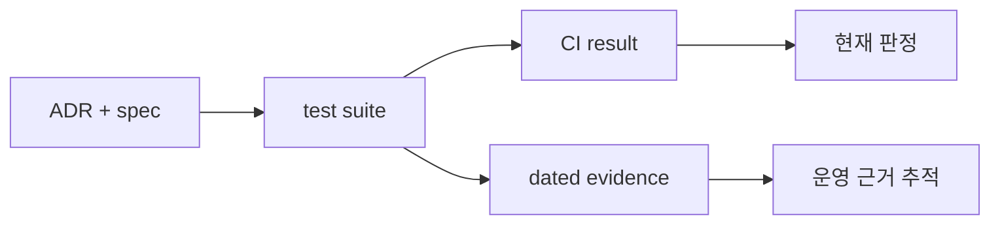

# Validation Evidence

각 문서는 특정 commit과 환경에서 실행한 검증 snapshot이다. 현재 branch는 같은 테스트의 재실행
또는 해당 commit의 CI check로 판정한다.

## Core lifecycle

| 기록 | 확인한 경계 |
|---|---|
| [Kind 기본 E2E](kind-e2e-2026-09-01.md) | 두 worker Pool, 기본 StorageClass, Helm 재설치 |
| [공개 artifact CI](public-artifact-ci-2026-09-04.md) | chart SHA-256, image digest, 실제 PVC mount |
| [Home 공개 chart capacity](home-public-chart-capacity-2026-09-06.md) | MicroK8s kubelet root, Pool 총예약 admission |
| [일반 directory Pool](general-directory-pools-2026-09-07.md) | root filesystem 하위 directory의 provisioning과 이동 |
| [Pool readiness](pool-readiness-2026-09-07.md) | 접근·쓰기·capacity 상태와 fault 자동 복구 |

## Mobility and recovery

| 기록 | 확인한 경계 |
|---|---|
| [Kind mobility](kind-mobility-e2e-2026-09-02.md) | cordon 이동, terminal 상태, Controller 재시작 |
| [Blocked owner recovery](blocked-owner-recovery-2026-09-03.md) | commit 전후 owner 복구와 데이터 보존 |
| [Non-disruptive preflight](nondisruptive-preflight-2026-09-04.md) | 제약·PDB·UID 확인 후 consumer 보존 |
| [API response loss](api-response-loss-2026-09-04.md) | API 반영 뒤 응답 유실의 멱등 수렴 |
| [Filesystem faults](mobility-filesystem-faults-2026-09-04.md) | ENOSPC, read-only, partial staging |
| [Node restarts](mobility-node-restarts-2026-09-05.md) | source·destination 중단과 owner 복구 |
| [Event-driven placement](event-driven-placement-2026-09-05.md) | Placement Hold, scheduler reservation, watch coalescing |
| [G0 safety](g0-safety-2026-09-06.md) | checksum, 부분 삭제 재시도, reservation 복구 |

## Operations and performance

| 기록 | 확인한 경계 |
|---|---|
| [Kind UltraQA](kind-ultraqa-2026-09-03.md) | plugin restart, 병렬 격리, admission·filesystem fault |
| [Argo CD uninstall](kind-argocd-uninstall-2026-09-03.md) | Application guard와 dependency 해소 후 삭제 |
| [Operator diagnostics](operator-diagnostics-2026-09-04.md) | Move 상태, Event, API 오류 복구 |
| [Home chart performance](home-public-chart-performance-2026-09-05.md) | lifecycle baseline과 cross-node 병목 A/B |
| [Node publish wait 검토](node-publish-wait-rejection-2026-09-05.md) | 대기 최적화 반증과 폐기 근거 |

| 정보의 종류 | 소유 문서 |
|---|---|
| 구조적 결정 | [`adr/`](../adr/README.md) |
| 현재 동작 계약 | [`spec/`](../spec/README.md) |
| 실행 방법과 합격 기준 | [`development/testing.md`](../development/testing.md) |
| 과거 실행 결과 | 이 디렉터리의 dated snapshot |
